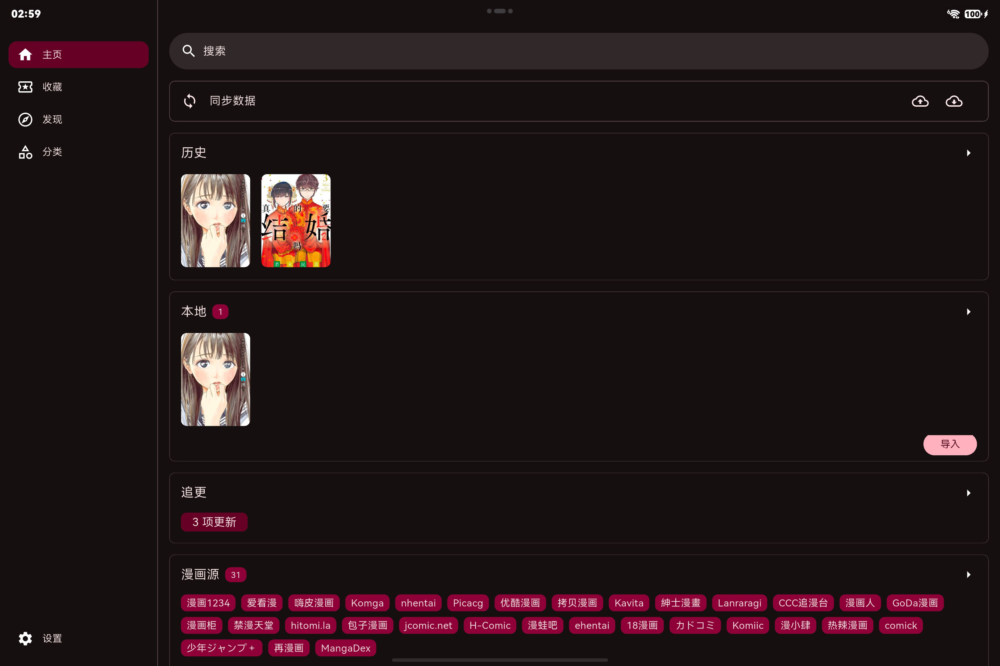
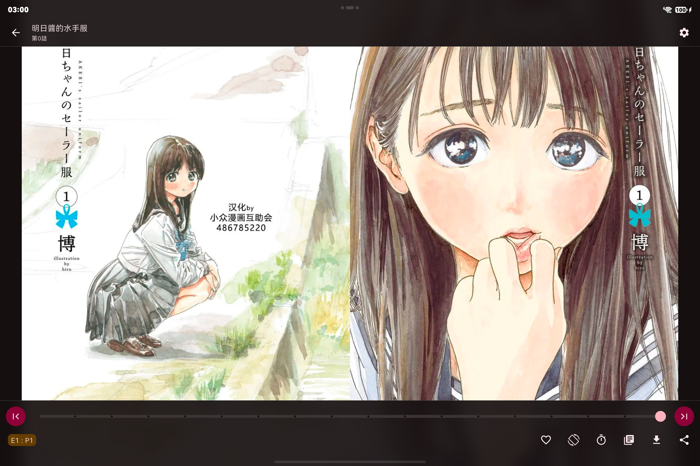

这篇文章介绍我维护的 **Venera 优化版**。它基于 [venera-app/venera](https://github.com/venera-app/venera)，保留本地与网络漫画阅读功能，主要围绕下载体验、导出性能和鸿蒙平台适配继续开发。

项目采用 AI 辅助开发（Vibe Coding）的方式推进。这是一个基于上游的个人维护分支，原项目作者为 **wgh136**，项目来源与版权信息保留在仓库中。

**项目入口：**[源码仓库](https://github.com/Leif-Wang-021/venera) · [下载与更新日志](https://github.com/Leif-Wang-021/venera/releases) · [问题反馈](https://github.com/Leif-Wang-021/venera/issues)

## 这个分支改了什么？

漫画下载往往会同时涉及章节目录、图片地址和图片文件。网络波动、站点限流、图片链接过期，都可能让任务卡在获取图片的阶段。这个分支对这些环节进行了调整。

| 改进方向 | 具体变化 |
| :--- | :--- |
| 下载调度 | 根据请求状态调整发起节奏，在正常请求、探测恢复和退避之间切换，降低持续触发限流的机会 |
| 失败恢复 | 加入指数退避与随机抖动，对过期的签名图片地址尝试刷新 |
| 异常隔离 | 对失效链接尽早结束重试，支持单张图片隔离和章节跳过，减少一个异常阻塞整项任务的情况 |
| 任务衔接 | 将列表获取与图片下载拆成两个阶段并行处理，通过章节就绪机制交接 |
| 取消与清理 | 取消任务时删除对应的本地文件夹 |
| 压缩导出 | 将压缩工作放到 Worker 中处理，提供字节级进度和取消能力；临时文件校验后再改名 |

这些改动的重点是让下载任务更容易恢复、让导出时的界面保持响应。实际效果仍会受到漫画源、网络和设备条件影响，具体实现说明见[仓库 README](https://github.com/Leif-Wang-021/venera/blob/main/README.md)。

## 鸿蒙适配

仓库增加了 HarmonyOS 平台工程和插件适配层，涉及 QuickJS 漫画源运行时、SQLite 数据库、网络请求、压缩文件、WebDAV 与阅读器等环节。

截至本文发布，最新公开版本为 **v1.7.1**。这个版本进一步调整了鸿蒙平板与 2in1 设备的使用体验：

- 增加平板和 2in1 设备类型，调整窗口方向配置。
- 开放全屏、分屏和悬浮窗口模式。
- 调整横屏下的安全区域与阅读器翻页判定。
- 为鸿蒙开放阅读器的屏幕旋转按钮，可锁定横屏阅读。
- 更新应用的分层图标资源，让桌面图标由系统处理外形掩膜。

以上是 [v1.7.1 的发布说明](https://github.com/Leif-Wang-021/venera/releases/tag/v1.7.1)所记录的适配内容。具体设备上的显示与交互问题，欢迎附上设备型号、系统版本和复现步骤反馈。

## 实机界面

下面展示鸿蒙设备上的实际运行界面，包括平板横屏首页、横屏漫画阅读和下载任务。

### 平板横屏首页

横屏时，导航位于左侧，右侧展示同步数据、阅读历史、本地漫画、追更和漫画源入口，方便在大屏上浏览与切换。

### 横屏漫画阅读

阅读界面展示漫画页面，顶部保留作品与章节信息，底部提供阅读进度、前后翻页和阅读工具入口。图中为《明日酱的水手服》的阅读界面。

### 下载任务

下载页显示当前传输速度、漫画封面、下载进度与暂停按钮。截图中的任务进度为 **28/393**，瞬时速度为 **616.10 KB/s**；这是截图时的任务状态，实际速度随网络与漫画源变化。

截图中的漫画封面及内容仅用于展示应用界面，相关作品版权归原作者及权利人所有。

## 下载与安装

安装包放在 GitHub Releases，博客提供入口，后续版本也以仓库发布页为准。

| 平台 | v1.7.1 安装包 |
| :--- | :--- |
| Windows | [Windows 安装程序](https://github.com/Leif-Wang-021/venera/releases/download/v1.7.1/venera-1.7.1-windows-installer.exe) |
| Android | [通用 APK](https://github.com/Leif-Wang-021/venera/releases/download/v1.7.1/venera-1.7.1-android-release.apk)；分架构 APK 见[版本发布页](https://github.com/Leif-Wang-021/venera/releases/tag/v1.7.1) |
| HarmonyOS arm64 | [已签名 HAP](https://github.com/Leif-Wang-021/venera/releases/download/v1.7.1/venera-1.7.1-ohos-arm64-signed.hap) · [未签名 HAP](https://github.com/Leif-Wang-021/venera/releases/download/v1.7.1/venera-1.7.1-ohos-arm64-unsigned.hap) |

**鸿蒙安装注意：**该版本的已签名 HAP 使用本机调试证书，目标设备的 UDID 必须包含在对应的调试 profile 中。下载后不一定能直接安装到任意设备；未签名包需要自行完成签名。这一限制已在[版本发布说明](https://github.com/Leif-Wang-021/venera/releases/tag/v1.7.1)中列出。

## 源码与反馈

仓库中的 `venera/` 是 Flutter 应用主工程，`venera/ohos/` 是鸿蒙平台工程，`venera/ohos_plugins/` 存放平台兼容插件。下载任务与压缩导出还提供了无头测试通道，便于回归验证。

遇到问题时，可以在 [Issues](https://github.com/Leif-Wang-021/venera/issues) 中说明应用版本、运行平台、触发操作和报错信息。下载异常最好补充停在哪个阶段；显示问题则可以附上截图。

本分支沿用上游 **GPL-3.0** 开源协议，详见[项目 LICENSE](https://github.com/Leif-Wang-021/venera/blob/main/venera/LICENSE)。本文记录的是截至 **2026 年 10 月 7 日** 的公开仓库与发布版本状态，后续变化请查看 Releases。
