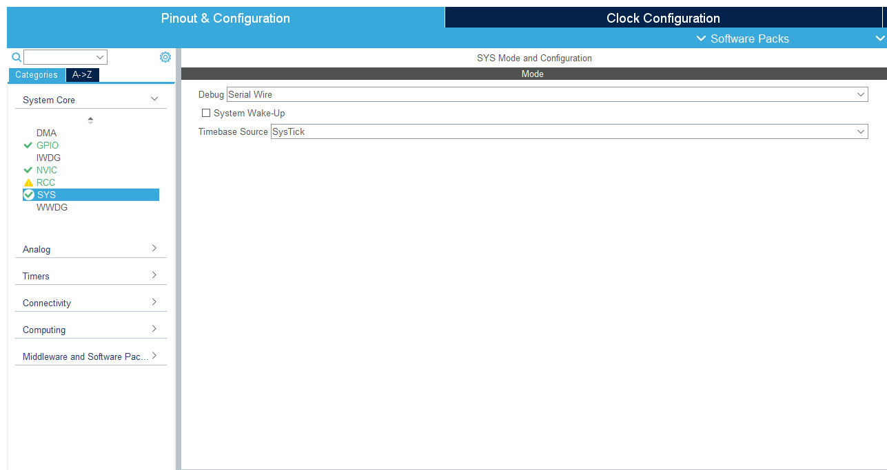
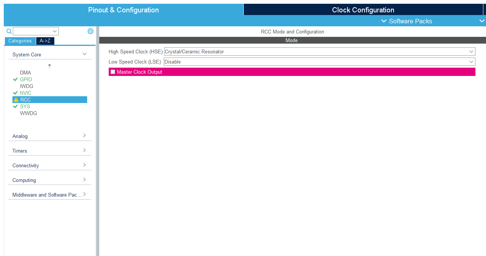
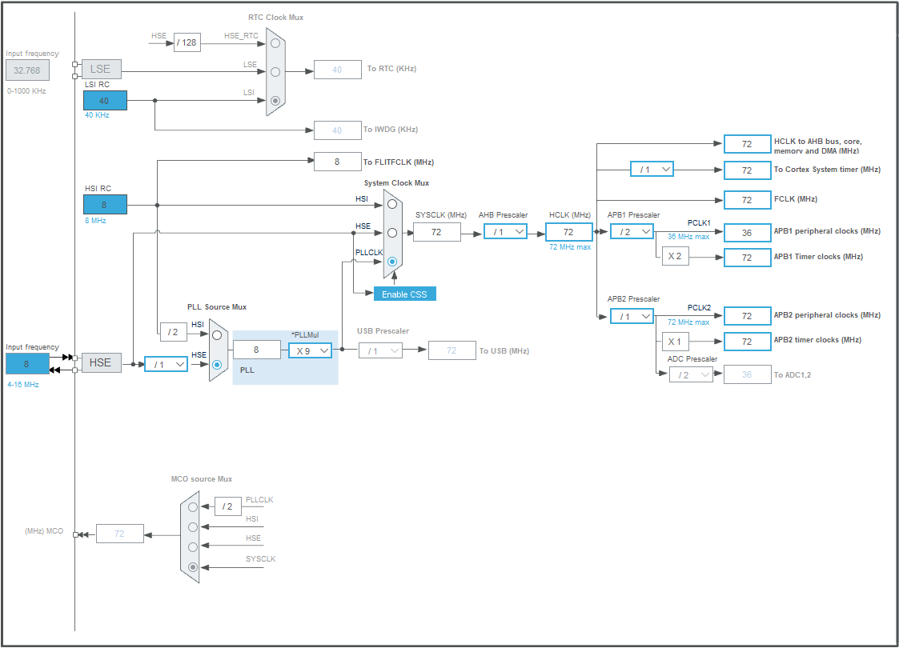
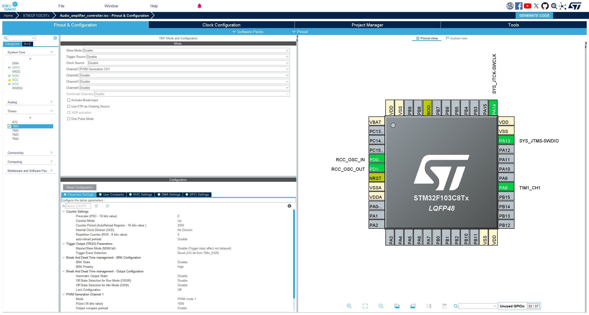
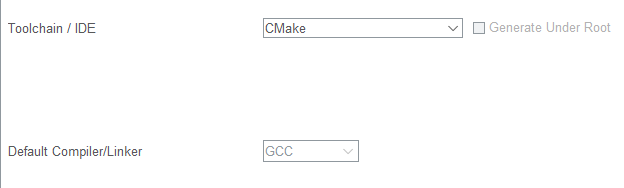
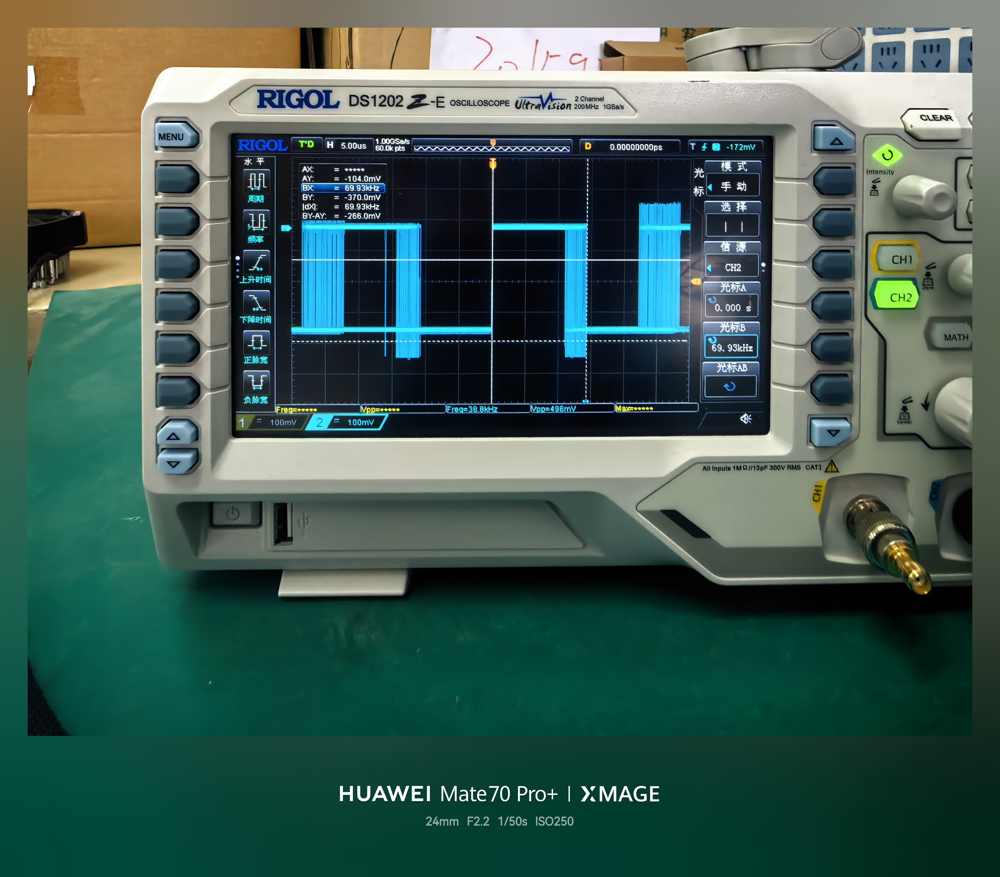

# Hi

我是，青叶，这是我的第一篇博客。在这篇博客中，我将记录我在毕业设计中实现扫频功能的过程，核心需求是利用 STM32F103C8T6 产生一段 35kHz - 45kHz 的高频 PWM 波，并且要求以 1kHz 的调制频率进行三角波扫频（即 1ms 内完成一次 35k->45k->35k 的循环）。

# 环境搭建

在开发过程中我使用的是 **VSCode与STM32CubeMX** 的组合，使用 STM32CubeMX 进行可视化的引脚配置，使用 VSCode 进行代码编写。我先前也接触过 STM32CubeIDE ，但在 2.0.0 版本后， STM32CubeIDE **移除**了内置的 STM32CubeMX ，仍需要在外部先由 STM32CubeMX 进行配置，因此我选择了 VSCode 作为我的主要开发环境。在配置完成后， VSCode 中添加了 STM32 的插件，并借助 VSCode 强大的插件功能，进行代码编写。

## 搭建教程

我参照了 keysking 在 Bilibili 的教程，进行了整个开发环境的搭建。

<iframe width="100%" height="468" src="//player.bilibili.com/player.html?isOutside=true&aid=115032427859038&bvid=BV1QfbpzGENy&cid=31715296031&p=1" scrolling="no" border="0" frameborder="no" framespacing="0" allowfullscreen="true"></iframe>

# 扫频的实现

扫频的实现是通过动态修改底层定时器的自动重装载寄存器（ARR）和比较寄存器（CCR）来实现的。由于我们的目标频率是超声波频段，STM32 处理起来游刃有余，但由于调制周期极短（1ms），这给代码的延时控制带来了一定的挑战。

## 核心原理与参数推导

STM32 产生 PWM 依赖于定时器。我们已知系统主频（SYSCLK）通常配置为最高速度 72MHz。计算 PWM 频率的核心公式如下：

$$\large Frequency = \frac{SYSCLK}{(PSC + 1) \times (ARR + 1)}$$

为了获得 35kHz - 45kHz 的高频，我们让预分频器全开，即设置 PSC = 0。根据公式反推：

> - 35kHz 对应的 ARR 值约为 2056
> - 45kHz 对应的 ARR 值约为 1599

所以，“扫频”的本质，就是在代码的死循环中，让 ARR 的值在 2056 到 1599 之间来回变化，同时保持 CCR = ARR / 2 使得占空比始终稳定在 50%。

## CubeMX 硬件配置

由于完全剥离了 IDE 内部集成，我们直接在独立的 STM32CubeMX 中进行初始化配置：

- 防锁死配置：在 System Core -> SYS 中，Debug 务必选择 Serial Wire。**这非常重要，否则烧录一次后引脚会被占用，导致单片机变砖**。



- 时钟配置：RCC 中开启外部高速晶振（HSE），在时钟树中将 HCLK 配置为满血的 72 MHz。




- 定时器配置：选择 TIM1，将 Clock Source 设为 Internal Clock。开启 Channel1 的 PWM Generation（对应引脚 PA8）。在 Parameter Settings 中，将 PSC 设为 0，ARR 暂填 2000（后续由代码动态接管）。



- 在 Project Manager 中，**Toolchain / IDE 选项必须下拉选择 CMake**，并勾选“Copy only the necessary library files”。这是打通 VSCode 编译环境的核心前提。这里与 STM32CubeIDE 的配置有较大差异，务必注意。



## 核心代码

在编写业务逻辑时，我遇到了一个巨大的挑战：**时间不够用**。

需求要求完成 35kHz 到 45kHz 的三角波扫频，且周期为 1ms。这意味着上升段（35k->45k）和下降段（45k->35k）各自只有 0.5ms (500us) 的执行时间。

平时常用的 HAL_Delay() 函数最小精度是 1 毫秒，在这里完全失效了。如果每次循环改变 1 个 ARR 的值，根本来不及在 0.5ms 内跑完几百步。因此，必须采用粗化步进 + 微秒级空转的策略。

在 main.c 中，启动 PWM 并写入扫频逻辑：

```c
/* USER CODE BEGIN 2 */
  HAL_TIM_PWM_Start(&htim1, TIM_CHANNEL_1); // 启动 TIM1 通道 1
/* USER CODE END 2 */
```
```c
/* USER CODE BEGIN WHILE */
  while (1)
  {
    // 上升段：35k -> 45k (分配 0.5ms)
    // 步进加大至 10，减少循环次数以提升速度
    for (uint16_t arr_val = 2056; arr_val >= 1599; arr_val -= 10) 
    {
      __HAL_TIM_SET_AUTORELOAD(&htim1, arr_val);
      __HAL_TIM_SET_COMPARE(&htim1, TIM_CHANNEL_1, arr_val / 2);
      // 放弃 HAL_Delay，使用 volatile 防止被编译器优化的微秒级延时
      // 72MHz 下循环 80 次，大约消耗几个微秒
      for(volatile int i = 0; i < 80; i++); 
    }
    // 下降段：45k -> 35k (分配 0.5ms)
    for (uint16_t arr_val = 1599; arr_val <= 2056; arr_val += 10) 
    {
      __HAL_TIM_SET_AUTORELOAD(&htim1, arr_val);
      __HAL_TIM_SET_COMPARE(&htim1, TIM_CHANNEL_1, arr_val / 2);
      for(volatile int i = 0; i < 80; i++); 
    }
  }
  /* USER CODE END WHILE */

 ``` 
 #  示波器验证
 在完成代码编写后，使用 STM32 插件连接 ST-LINK ，将程序烧录到开发板上。随后，使用示波器探头连接到 PA8 引脚，观察输出波形。

 

 开启余晖，可以更好的看到扫频的范围，再使用光标测量半个周期的宽度。

 
 

因为测量的是半个周期的宽度，所以需要将测量结果除以 2 以得到频率。可以看到频率为 90kHZ 到 70kHZ ，可得出实际扫频范围为 45kHz 到 35kHz，完全符合预期。 

至此，多功能音频功率放大器系统中极其关键的超声波扫频信号源已经搭建完毕。接下来就可以将这路信号送入大功率放大模块，驱动超声波换能器了。