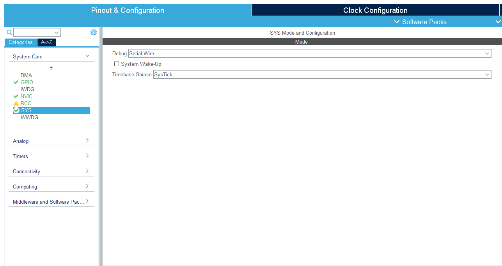
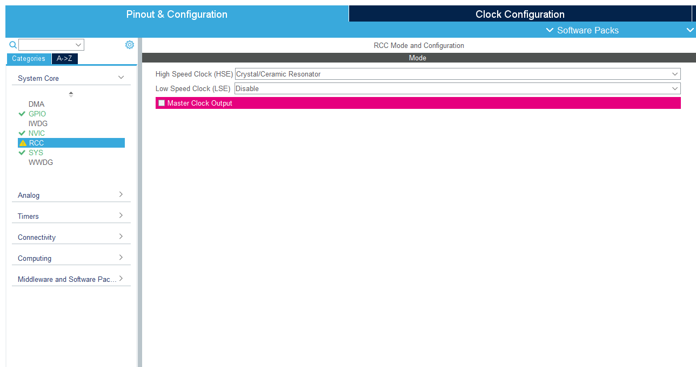
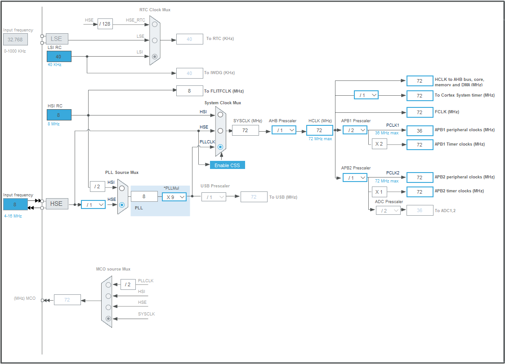
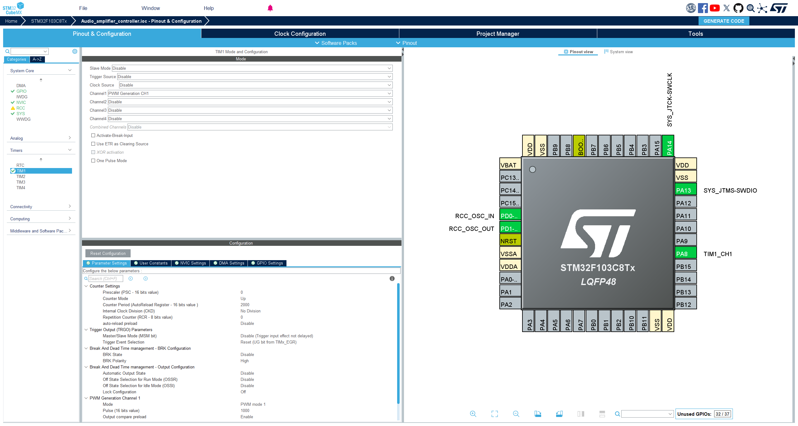
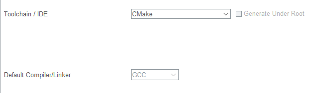
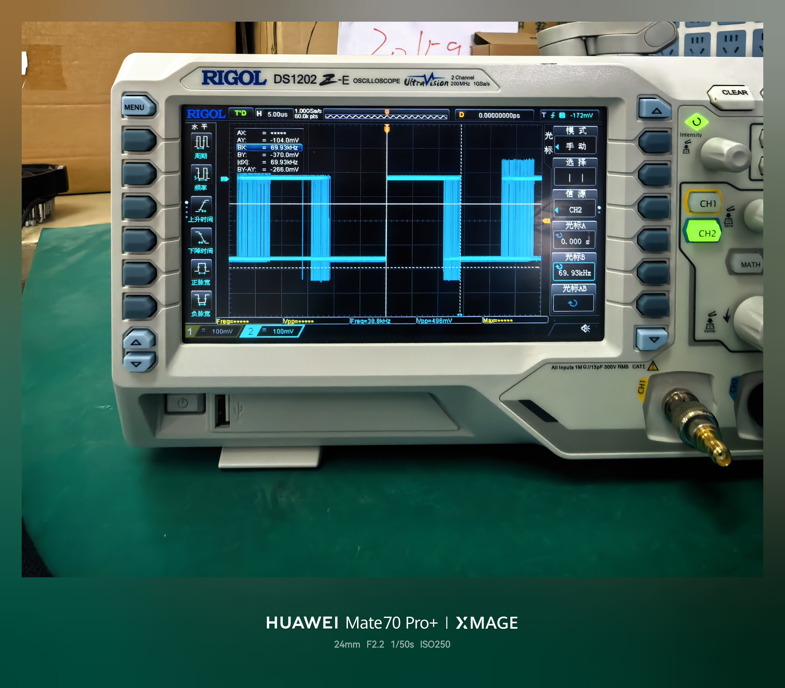

## 目标与实验范围

这是我在毕业设计中实现扫频信号源的记录。目标是用 STM32F103C8T6 产生 35–45 kHz 的 PWM 波，并以 1 kHz 的调制频率进行三角波扫频，即在 1 ms 内完成一次 35 kHz → 45 kHz → 35 kHz 的循环。

本文记录定时器配置、扫频代码和频率范围测量。1 ms 是设计目标；下文的空转延时需要进一步标定，现有记录尚不足以确认扫频周期精确达到该值。


## 环境搭建

在开发过程中我使用的是 **VS Code与STM32CubeMX** 的组合，使用 STM32CubeMX 进行可视化的引脚配置，使用 VS Code 进行代码编写。我先前也接触过 STM32CubeIDE ，但在 2.0.0 版本后， STM32CubeIDE **移除**了内置的 STM32CubeMX ，仍需要在外部先由 STM32CubeMX 进行配置，因此我选择了 VS Code 作为我的主要开发环境。在配置完成后， VS Code 中添加了 STM32 的插件，并借助 VS Code 强大的插件功能，进行代码编写。

### 搭建教程

我参照了 [keysking](https://space.bilibili.com/6100925) 在 Bilibili 的教程，进行了整个开发环境的搭建。

<iframe width="100%" height="468" src="//player.bilibili.com/player.html?isOutside=true&aid=115032427859038&bvid=BV1QfbpzGENy&cid=31715296031&p=1" scrolling="no" border="0" frameborder="no" framespacing="0" allowfullscreen="true"></iframe>

## 扫频的实现

扫频通过动态更新定时器的自动重装载寄存器（ARR）和比较寄存器（CCR）实现。ARR 决定每一步的 PWM 频率，寄存器更新节奏决定完整扫描所需的时间。

### 核心原理与参数推导

STM32 产生 PWM 依赖于定时器。我们已知系统主频（SYSCLK）通常配置为最高速度 72MHz。计算 PWM 频率的核心公式如下：

$$\large Frequency = \frac{SYSCLK}{(PSC + 1) \times (ARR + 1)}$$

为了获得 35kHz - 45kHz 的高频，我们让预分频器全开，即设置 PSC = 0。根据公式反推：

> - 35kHz 对应的 ARR 值约为 2056
> - 45kHz 对应的 ARR 值约为 1599

所以，“扫频”的本质，就是在代码的死循环中，让 ARR 的值在 2056 到 1599 之间来回变化，同时保持 CCR = ARR / 2 使得占空比始终稳定在 50%。

### CubeMX 硬件配置

由于完全剥离了 IDE 内部集成，我们直接在独立的 STM32CubeMX 中进行初始化配置：

- 调试接口配置：在 System Core → SYS 中选择 Serial Wire，以保留本实验使用的 SWD 调试接口。后续修改引脚配置时，也应检查是否影响调试连接。



- 时钟配置：RCC 中开启外部高速晶振（HSE），在时钟树中将 HCLK 配置为满血的 72 MHz。




- 定时器配置：选择 TIM1，将 Clock Source 设为 Internal Clock。开启 Channel1 的 PWM Generation（对应引脚 PA8）。在 Parameter Settings 中，将 PSC 设为 0，ARR 暂填 2000（后续由代码动态接管）。



- 在 Project Manager 中，**Toolchain / IDE 选项必须下拉选择 CMake**，并勾选“Copy only the necessary library files”。这是打通 VS Code 编译环境的核心前提。这里与 STM32CubeIDE 的配置有较大差异，务必注意。



### 核心代码

在当前配置下，`HAL_Delay()` 使用毫秒级延时，不能直接用于安排半个扫频周期内的多次更新。本文先采用较大的 ARR 步进和空转延时进行验证。空转耗时会受到编译优化、指令开销等因素影响，需要通过测量确认。

需求要求完成 35kHz 到 45kHz 的三角波扫频，且周期为 1ms。这意味着上升段（35k->45k）和下降段（45k->35k）各自只有 0.5ms (500us) 的执行时间。


在 main.c 中，启动 PWM 并写入扫频逻辑：

```c
/* USER CODE BEGIN 2 */
  HAL_TIM_PWM_Start(&htim1, TIM_CHANNEL_1); // 启动 TIM1 通道 1
/* USER CODE END 2 */
```
```c
/* USER CODE BEGIN WHILE */
  while (1)
  {
    // 上升段：35k -> 45k (分配 0.5ms)
    // 步进加大至 10，减少循环次数以提升速度
    for (uint16_t arr_val = 2056; arr_val >= 1599; arr_val -= 10) 
    {
      __HAL_TIM_SET_AUTORELOAD(&htim1, arr_val);
      __HAL_TIM_SET_COMPARE(&htim1, TIM_CHANNEL_1, arr_val / 2);
      // 放弃 HAL_Delay，使用 volatile 防止被编译器优化的微秒级延时
      // 72MHz 下循环 80 次，大约消耗几个微秒
      for(volatile int i = 0; i < 80; i++); 
    }
    // 下降段：45k -> 35k (分配 0.5ms)
    for (uint16_t arr_val = 1599; arr_val <= 2056; arr_val += 10) 
    {
      __HAL_TIM_SET_AUTORELOAD(&htim1, arr_val);
      __HAL_TIM_SET_COMPARE(&htim1, TIM_CHANNEL_1, arr_val / 2);
      for(volatile int i = 0; i < 80; i++); 
    }
  }
  /* USER CODE END WHILE */

```

## 示波器验证

在完成代码编写后，使用 STM32 插件连接 ST-LINK ，将程序烧录到开发板上。随后，使用示波器探头连接到 PA8 引脚，观察输出波形。


开启余晖，可以更好的看到扫频的范围，再使用光标测量半个周期的宽度。




因为测量的是半个周期的宽度，所以需要将测量结果除以 2 以得到频率。可以看到频率为 90kHz 到 70kHz ，可得出实际扫频范围为 45kHz 到 35kHz，完全符合预期。

这一步完成了 PWM 扫频信号源的初步搭建与频率范围观察。后续仍需测量完整扫频周期，再与功率放大模块和超声波换能器联调；相关方案见本系列第 02 篇。
