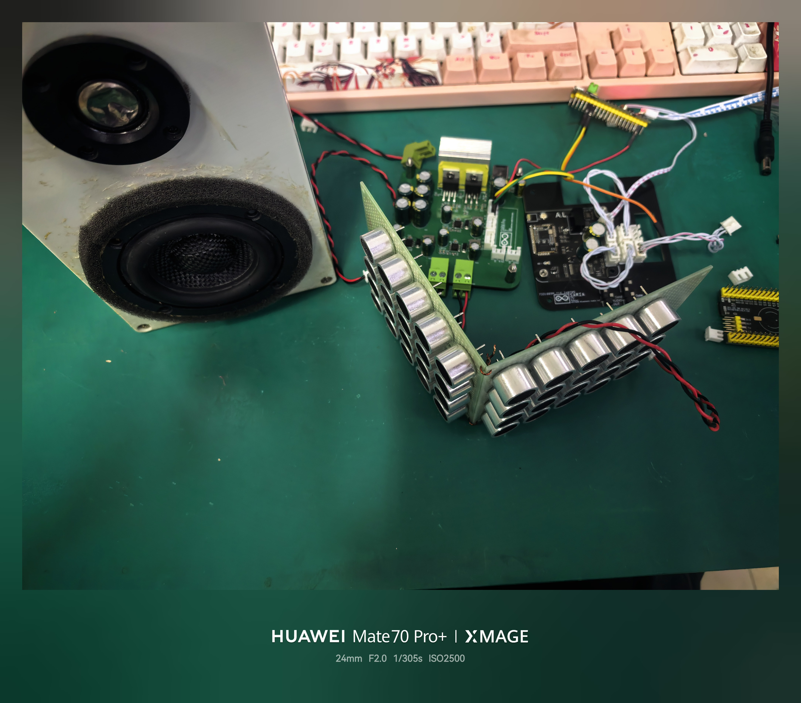
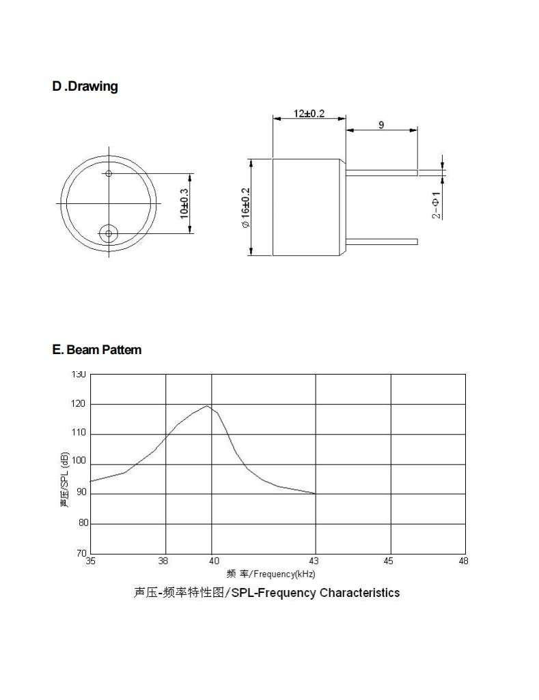

# 系统搭建

在上一篇博文中实现了 35kHz - 45kHz 的 PWM 扫频。接下来，我将介绍如何使用超声波实现录音屏蔽。我使用了 LM1875 音频放大器，并使用 TPS5430 电源模块。搭建了一个非常简易:spoiler[简陋]的系统，用于录音屏蔽。我使用的是 DC 输入，按照 TPS5430 数据手册的拓扑将输入电压分别转换为 +9V 、 -9V 和 +5V ，供 LM1875以及单片机使用。这些芯片的性能可能并没有非常优越，但作为本科阶段简单实现录音屏蔽功能的话也足够用了。

超声波屏蔽使用的波形为先前生成的 PWM 波。对 PWM 波形实现功率放大时，由于 PWM 波形单一，只有高电平和低电平两种状态。那么想象用手控制一个电源开关，当看到高电平时就接通开关，看到低电平时断开开关，此时原本的 PWM 信号就变成了一个控制信号，而电源输出信号的波形则与控制信号完全相同，且功率更大，这样也可以看作是实现了功率的放大。因此利用半桥或直接使用 MOS 管来做这个开关可以达到很高的效率。在 2024 年 TI 杯省赛的 G 题中，我们队伍就使用了这种方案。

不过在本篇方案里我使用了另一个方案：LM1875。由于我的毕业设计项目需要兼顾音频放大的功能，而 LM1875 的典型增益带宽积（GBW）为 5.5 MHz（在 $$f_o$$ = 20kHz 条件下测定）。

那么增益带宽积是什么呢？它是一个运算放大器的核心性能指标，可以简单理解成：一个放大器的“放大能力”和“能放大的频率范围”之间的乘积大致固定。也就是说：

$$\text{增益带宽积} \approx \text{增益} \times \text{频率}$$

$$GBW = A_v \times f$$

如果一个运放/功放的增益带宽积是 5.5MHz，那么：

- 在 20kHz 时，理论最大增益约为：$$\large A_{v(max)} = \frac{5.5 \times 10^6\text{ Hz}}{20 \times 10^3\text{ Hz}} = 275 \approx 49.1\text{ dB}$$
- 在 40kHz 时，理论最大增益约为：$$\large A_{v(max)} = \frac{5.5 \times 10^6\text{ Hz}}{40 \times 10^3\text{ Hz}} = 137.5 \approx 42.7\text{ dB}$$

虽然理论上有 137 倍的放大极限，但为了保持足够的环路增益（Loop Gain）来压制高频非线性失真并保持系统稳定，建议将实际的闭环增益控制在 10 ~ 30 倍（20 dB ~ 29 dB） 之间。在这个增益区间内，40kHz 信号的幅度响应依然是非常平坦的。

先前已经完成了硬件搭建，本篇暂不赘述硬件部分，若以后有机会继续完善，将记录硬件搭建过程。

# 超声波屏蔽原理

## 使用PWM波进行屏蔽

方波包含极其丰富的基频和谐波。而超声波发射探头本身是一个具有极高 Q 值的物理带通滤波器（中心频率 40kHz）。当方波加在探头上时，探头会自动滤除那些无用的高频谐波，只把 40kHz 及其附近的频率转化为声能辐射出去。

## 接收端：录音屏蔽的核心物理机制

当我使用 LM1875 将 STM32 产生的 35kHz - 45kHz 扫频 PWM 波放大，并驱动超声波探头发射出去后，巧妙地利用了硬件电路在极限状态下的物理缺陷。其核心机制主要分为以下两点：

### 1. 麦克风的非线性互调失真 (IMD - Intermodulation Distortion)

这是录音屏蔽最本质、也是最致命的物理原理。

无论是手机里的 MEMS 麦克风，还是驻极体麦克风，它们在面对大功率、高声压的超声波时，其内部的物理膜片或前置模拟放大电路都会被迫进入**非线性工作区**。

在理想的线性系统中，输入什么频率，输出就是什么频率。但在非线性系统中（其传递函数往往包含平方项或高次项），当存在多个频率成分时，它们会发生“相乘效应”。

回顾一下我们使用 STM32 生成的波形：我们并没有发射单一的 40kHz 频率，而是让频率在 **35kHz 到 45kHz 之间进行三角波扫频**。这意味着在极短的时间内，空间中同时存在着不同频率的超声波成分（例如 $f_1$ = 40kHz 和 $f_2$ = 41kHz）。

当这两个高频信号同时作用于处于非线性状态的麦克风时，就会产生互调失真，凭空生成一个**差频信号**：

$$f_{IMD} = |f_2 - f_1| = |41\text{kHz} - 40\text{kHz}| = 1\text{kHz}$$

这个 1kHz 的差频信号，不偏不倚，恰好落在了人耳最敏感、也是录音设备主要采集的语音频带（20Hz - 20kHz）内。

**最关键的是：** 这个低频噪声是在进入 ADC（模数转换器）采样**之前**，就在模拟物理端凭空生成的。因此，无论后端的数字信号处理（DSP）算法有多么先进的降噪逻辑，都无法将它与正常的人声区分开来，从而完美地掩蔽了语音。

### 2. ADC 欠采样与频谱混叠 (Aliasing)

除了模拟端的失真，数字采样端的缺陷也为屏蔽效果“推波助澜”。

根据奈奎斯特-香农采样定理（Nyquist–Shannon sampling theorem），为了不失真地恢复模拟信号，采样频率 $f_s$ 必须大于信号最高频率的两倍。现代智能手机和常规录音模块的 ADC 采样率通常为 44.1kHz。这意味着它们能完美处理的最高信号频率（奈奎斯特频率）大约为 22.05kHz。

为了防止高频信号干扰，ADC 前端通常会配置抗混叠滤波器。然而，面对距离极近、声压极大的40kHz 频段超声波时，这些滤波器的衰减往往不够彻底。

当高能的 40kHz 信号硬挤进采样率为 44.1kHz 的 ADC 时，由于不满足采样定理，高于 $\large \frac{f_s}{2}$ 的高频能量会像折纸一样被“回卷（Fold-back）”到低频可听区域。这种频谱混叠会在录音中形成强烈的、类似于“沙沙”声的宽带白噪声。

### 总结：为什么必须要用 35kHz - 45kHz 扫频？

看到这里，你就明白为什么要使用 35kHz - 45kHz 的三角波扫频逻辑了。

如果只发射纯净的 40kHz 超声波，经过互调失真后，也只会产生单一的高频哨声，无法有效掩盖人类语音丰富的频谱。而通过扫频（本质上是一种调频 FM），我们在超声波频段内铺开了一张宽带网。这张网经过麦克风的非线性解调后，会在 0  -  10kHz 的人声黄金频段内化作漫天暴雪般的宽带噪声，让窃听设备彻底失去作用。

