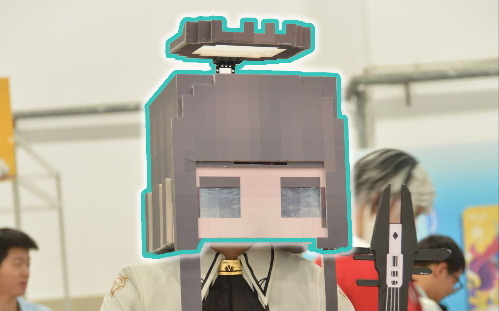

本文记录我对“数字化 COS 头套”项目的前期企划想法和技术规划。目前项目还处于方案构思阶段，文中提到的第一版、原型和结构方案，均为后续准备验证的方向。

这个项目的起点来自我之前用 KT 板制作 MC 风格明日方舟 COS 头套的经历。当时的外观效果虽然比较直观，但是实际佩戴时暴露出了两个非常明显的问题：一是散热和通风不好，长时间佩戴会闷热；二是视野很差，行动时安全性和舒适性都不够理想。




这次我希望未来不只是再做一个静态头套，而是尝试规划一个具有屏幕表情、摄像头视野、内部显示、通风结构和模块化外壳的可迭代平台。它既要能服务于某一个角色，也要尽量形成一套通用结构，方便之后更换不同角色的外观模块。

# 项目目标

这个项目的核心目标可以概括为：在保证安全、舒适和可维护的前提下，设计并逐步验证一个可显示动态表情、可辅助观察外部环境、并且便于更换角色外壳的数字化 COS 头套方案。

具体目标如下：

- 外部显示：头套正面使用 13 寸屏幕显示角色表情，实现眨眼、说话、待机、互动反馈等效果。
- 内部观察：在头套前方加入摄像头，并在内部眼前放置近眼显示结构，用类似 VR 或 FPV 的方式辅助观察。
- 模块化结构：头套骨架、外壳、屏幕、摄像头、通风、电池和控制模块尽量拆分，方便维护和更换。
- 角色复用：核心电子系统和基础骨架尽量通用，不同角色主要通过外壳、表情素材和局部装饰进行切换。
- 佩戴体验：重点解决散热、重量、视野、线缆固定和紧急脱离等问题。

# 需求分析

## 外观需求

头套整体希望保留类似 MC 风格的方块化视觉语言，因此前脸可以采用较平整的面板结构，便于安装 13 寸屏幕。屏幕本身既是角色脸部的主要表达区域，也是整个项目最显眼的视觉中心。

外观模块需要尽量支持快速拆装。例如不同角色的发型、耳朵、角、装甲、帽子等部分可以做成独立件，通过磁吸定位、卡扣固定或螺丝连接安装到主骨架上。

## 功能需求

| 模块 | 功能 | 初步要求 |
| :--- | :--- | :--- |
| 外部表情屏 | 显示角色脸部表情 | 支持 HDMI 输入，全屏显示动画或实时渲染界面 |
| 前置摄像头 | 获取前方视野 | 优先选择广角，降低盲区 |
| 内部显示 | 辅助佩戴者观察 | 需要考虑焦距、延迟、亮度和眼部舒适度 |
| 主控系统 | 运行表情和交互程序 | 第一版优先选择开发方便的平台 |
| 辅助控制 | 控制风扇、按键、传感器、灯效 | 可由 MCU 独立负责 |
| 通风散热 | 给人和电子模块散热 | 人体通风和电子散热尽量分开设计 |
| 电源系统 | 给屏幕、主控、风扇供电 | 需要稳定、安全、可拆卸 |

## 安全需求

因为这是一个需要戴在头上的设备，所以安全性必须优先于酷炫程度。内部显示和摄像头不应该成为唯一视野来源，最好保留一个隐藏式物理观察窗口，以防摄像头、主控或电源出现问题。

此外，还需要设计以下安全措施：

- 头套内部不能有尖锐边缘。
- 头套必须能够快速摘下。
- 电池尽量不要完全塞进头套内部。
- 风扇进出风口不能直接吹眼睛。
- 屏幕和驱动板附近要避免热量堆积。
- 所有电源线和信号线需要做应力释放，避免活动时松脱。

# 总体方案

我目前倾向于采用“Linux 主控 + MCU 辅控”的结构。

Linux 主控负责计算量较大的部分，例如外部屏幕表情显示、摄像头画面处理、音频或交互逻辑。MCU 负责实时性和稳定性要求更高但计算量较小的部分，例如风扇调速、温湿度采集、按键输入、灯效控制、电量检测和安全状态监测。

```text
摄像头  ->  Linux 主控  ->  内部显示
                  |
                  +----> 13 寸外部表情屏
                  |
                  +----> MCU 辅控 <---- 按键 / 传感器 / 风扇 / 灯效
                  |
电池 / 电源管理 ----+
```

这样的好处是开发比较灵活。表情动画、互动逻辑和摄像头画面可以先在 Linux 上快速实现，而风扇和传感器这类底层模块可以交给 MCU，避免主控系统卡顿时影响基础安全功能。

# 主控选型

我目前考虑过 STM32、树莓派、香橙派和 FPGA。它们都能用于这个项目的一部分，但并不适合承担同样的任务。

| 方案 | 优点 | 局限 | 初步定位 |
| :--- | :--- | :--- | :--- |
| STM32 | 实时性好，功耗低，控制外设方便 | 不适合直接承担 HDMI 表情屏和摄像头显示 | 适合作为辅控 |
| 树莓派 | 资料多，生态成熟，HDMI 和摄像头支持方便 | 功耗和发热需要控制 | 适合第一版主控 |
| 香橙派 | 性能强，部分型号接口丰富 | 系统和驱动调试成本可能更高 | 适合后续增强版 |
| FPGA | 视频链路延迟低，适合硬件级处理 | 开发成本高，第一版不够灵活 | 暂不作为第一版核心 |

第一版我更倾向于使用树莓派作为主控，例如树莓派 5 或类似性能的 Linux 单板计算机。它可以通过 HDMI 驱动外部 13 寸屏幕，也可以接摄像头并输出内部观察画面。等整体结构和功能跑通之后，再考虑是否使用 CM 系列、香橙派或自定义载板进行小型化。

STM32 更适合承担底层控制任务，例如：

- PWM 控制风扇转速。
- 读取温湿度传感器。
- 读取按键、旋钮或拨码开关。
- 控制状态灯和装饰灯。
- 监控电量和电源状态。
- 在主控异常时保持基础通风。

# 屏幕与显示

目前已经购买了一块 13 寸低色域屏幕，并配有 mini HDMI 和 Type-C 一线通驱动板。低色域屏幕不太适合显示细腻的颜色渐变，但是对于方块化、动漫化、符号化的表情来说问题不大。表情素材可以尽量采用高对比、大色块、粗线条的风格。

外部表情屏的初步功能包括：

- 待机表情。
- 眨眼动画。
- 说话动画。
- 高兴、生气、疑惑、害羞等表情状态。
- 按键或手机控制切换表情。
- 后续可以加入语音触发或动作触发。

内部显示部分需要单独验证。普通屏幕如果直接放在眼前，眼睛可能无法舒适对焦，因此需要考虑近眼显示方案，例如使用现成 FPV 显示模块、VR 透镜结构，或者小尺寸 HDMI 屏幕配合合适焦距的透镜。

# 视野设计

视野是这个项目最关键的问题之一，摄像头需要重点测试以下指标：

- 视角是否足够宽。
- 暗光环境下是否可用。
- 画面延迟是否可以接受。
- 画面畸变是否影响判断距离。
- 佩戴走动时是否容易眩晕。

# 结构设计

结构上我希望采用“龙骨骨架 + 外壳模块 + 电子模块”的思路。

骨架负责承重和定位，外壳负责角色外观，电子模块负责显示、观察、散热和交互。这样后续如果要更换角色，就不需要重做整个头套，只需要更换外壳和表情素材。

## 骨架材料

候选材料如下：

| 材料 | 特点 | 适合位置 |
| :--- | :--- | :--- |
| 碳纤维杆 | 轻，刚性好 | 主龙骨、边框 |
| 玻纤杆 | 成本较低，绝缘 | 辅助支撑 |
| 铝条 | 加工方便，刚性好 | 局部承力件 |
| PETG 打印件 | 韧性比 PLA 好 | 连接节点、安装座 |
| PA-CF 打印件 | 强度高，耐热较好 | 高强度节点 |
| EVA 泡棉 | 轻，易塑形 | 外观覆盖层 |

第一版可以先使用碳纤维杆或铝条做基础框架，再用 3D 打印件作为连接节点。这样比整块打印更轻，也比纯 KT 板更容易保证结构强度。

## 模块连接

模块连接方式可以分成两类：

- 定位连接：磁铁、定位销、滑槽。
- 承力连接：螺丝、卡扣、插销、热熔铜螺母。

磁吸适合辅助定位，但不适合作为唯一承力方式。尤其是屏幕、摄像头和电池相关模块，必须有可靠的机械固定。

# 通风与散热

这个项目的热源主要来自三个部分：佩戴者自身、13 寸屏幕与驱动板、主控板和电源模块。通风设计不能只考虑电子散热，还要考虑人的呼吸、面部闷热和镜片起雾。

初步思路是将风道分为两套：

- 人体通风风道：从下巴或侧脸进风，从头顶或后脑排风。
- 电子散热风道：让空气经过主控板、屏幕驱动板和电源模块，再从独立出口排出。

风扇可以优先考虑小型涡轮风扇，因为它更适合接风道。普通轴流风扇风量大但静压较低，如果头套内部空间曲折，实际效果可能不如涡轮风扇稳定。

需要预留的传感器包括：

- 温度传感器。
- 湿度传感器。
- 电池电压检测。
- 可选的二氧化碳或空气质量检测。

# 电源方案

第一版可以先采用外置电池方案，把电池放在腰包或背包里，通过一根主电源线连接头套。这样可以减轻头部重量，也可以降低电池在头部附近发热或碰撞的风险。

初步电源需求如下：

| 模块 | 估计功耗 |
| :--- | :--- |
| 13 寸屏幕 | 约 8W 到 15W |
| Linux 主控 | 约 5W 到 12W |
| 内部显示 | 约 2W 到 5W |
| 摄像头 | 约 1W |
| 风扇与灯效 | 约 2W 到 8W |

总功耗可以先按 25W 到 40W 估算。电源系统需要重点关注稳压能力、线材电流、接口可靠性和保险保护。

电源设计原则：

- 主电源入口需要有总开关。
- 电池输出端建议加入保险丝。
- 主控和屏幕最好分路供电。
- 5V 供电线需要足够粗，避免压降导致主控不稳定。
- 所有电源接口尽量做防呆。

# 软件设想

软件部分可以先分成三个层次：

| 层次 | 内容 |
| :--- | :--- |
| 表情显示层 | 全屏显示角色表情、播放动画、状态切换 |
| 交互控制层 | 按键、手机控制、语音触发、动作触发 |
| 底层监控层 | 风扇调速、温湿度、电量、异常报警 |

第一版表情显示可以先做得简单一些，例如使用网页全屏、Pygame、Godot 或 Electron 显示动画。只要能稳定输出到 13 寸屏幕，就可以先验证外观效果。

后续可以考虑加入：

- 通过手机网页控制表情。
- 通过蓝牙手柄或小按键切换状态。
- 根据麦克风音量播放说话动画。
- 根据 IMU 判断点头、摇头等动作。
- 通过无线网络更新表情素材。

<!-- # 后续原型计划

为了避免一开始把结构、电子、软件和外观全部混在一起，后续如果进入实物制作阶段，第一版最好先拆成几个小原型逐步验证。

## 原型 1：桌面显示验证

目标是让主控稳定输出到 13 寸屏幕，并显示全屏表情。

验收标准：

- 屏幕能稳定点亮。
- 分辨率和刷新率正常。
- 表情程序可以全屏运行。
- 屏幕供电和主控供电互不干扰。

## 原型 2：摄像头视野验证

目标是验证前置摄像头到内部显示的延迟和画面可用性。

验收标准：

- 摄像头画面可以低延迟显示。
- 佩戴者能判断前方障碍物。
- 走动时不明显眩晕。
- 暗光环境下仍能基本使用。

## 原型 3：开放式骨架验证

目标是先不做完整外壳，只做骨架、屏幕固定、摄像头固定和基础佩戴结构。

验收标准：

- 头套可以稳定佩戴。
- 屏幕固定可靠。
- 重心不会明显前坠。
- 可以快速摘下。

## 原型 4：通风验证

目标是在开放式骨架上加入风扇和风道，测试长时间佩戴体验。

验收标准：

- 连续佩戴 20 分钟不明显闷热。
- 屏幕和主控温度可控。
- 风扇噪声可以接受。
- 风道不会直接吹眼睛。

## 原型 5：角色外壳验证

目标是在基础平台上安装第一套角色外壳，并测试实际 COS 场景中的效果。

验收标准：

- 外观完整。
- 模块拆装方便。
- 表情和角色风格统一。
- 行走、转头、互动时结构稳定。

# 当前物料状态

目前已经拥有：

- 13 寸低色域屏幕。
- mini HDMI + Type-C 一线通驱动板。

下一步优先补齐：

- Linux 主控板。
- 前置广角摄像头。
- 内部显示方案。
- 风扇和温湿度传感器。
- 基础骨架材料。
- 电源转换模块和线材。

# 待解决问题

目前还需要继续验证的问题包括：

- 13 寸屏幕的实际亮度是否适合漫展环境。
- 屏幕和驱动板的实际功耗是多少。
- 内部显示采用哪种近眼方案最舒服。
- 摄像头画面延迟能否控制在可接受范围。
- 头套整体重量是否会超过长时间佩戴的舒适范围。
- 电池放在腰包、背包还是头套后部更合适。
- 外壳模块的标准接口如何设计。 -->

# 小结

这个项目目前仍处于企划阶段，目前优先验证三个关键问题：视野、散热和重量。只要这三个问题能够跑通，后续的表情系统、角色外壳和互动功能就可以逐步迭代。

我的初步路线是：先做一个开放式工程原型，用树莓派或类似 Linux 单板计算机负责屏幕和摄像头，用 STM32 或其他 MCU 负责风扇、传感器和基础控制。等原型稳定后，再把结构模块化，并逐步发展成可以适配不同角色的数字化 COS 头套平台。
