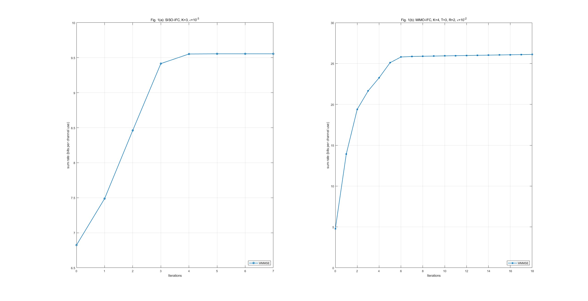
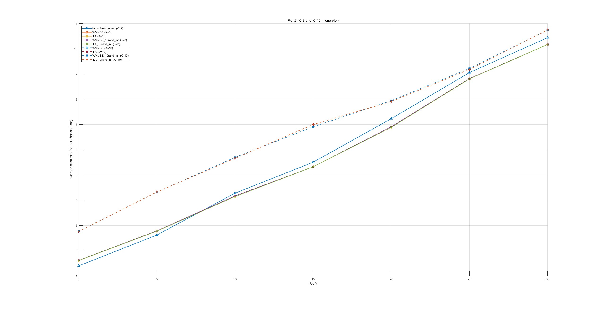
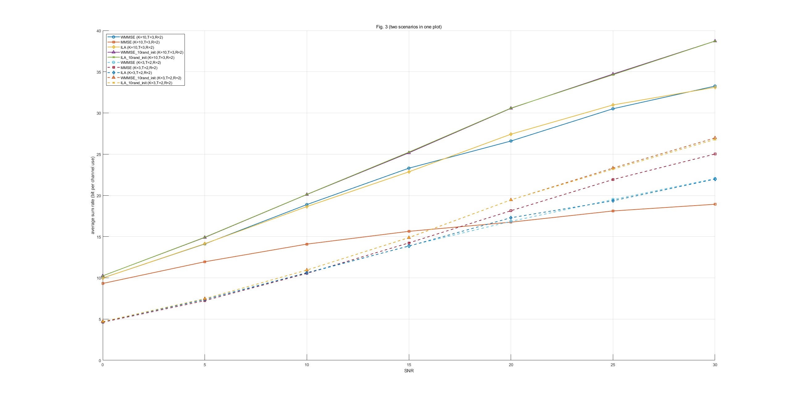
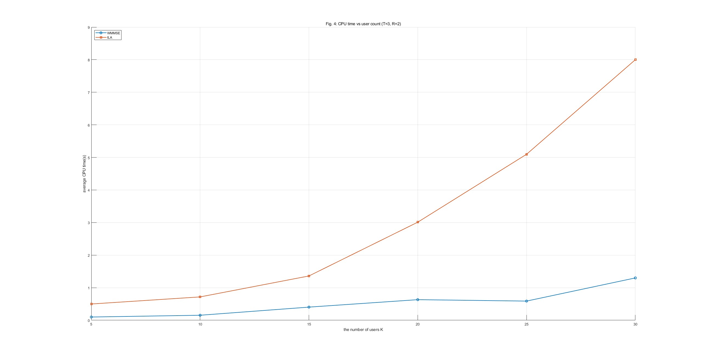

本文是论文《An Iteratively Weighted MMSE Approach to Distributed Sum-Utility Maximization for a MIMO Interfering Broadcast Channel》的读书笔记，并尝试复现了文中的算法。

# 摘要

这篇论文的目标是：在多个天线阵列同时发射、且存在严重互相干扰的广播网络中，通过联合设计发射和接收滤波器，在“增强期望信号”与“抑制对别人的干扰”之间达成最优平衡，从而最大化整个系统的总通信速率。

## 加权和速率最大化
在通信里，算速率用的是香农公式 $C = \log_2(1 + S/N)$。但在我们的场景里，有干扰存在，公式变成了 $R = \log_2(1 + \text{SINR})$（信干噪比）。

### 信干噪比

在无干扰的理想世界里，只有信号 $S$ 和底噪 $N$。但在多基站多用户场景下，公式里的 $\text{SINR}$（信干噪比）长这样：$$\text{SINR} = \frac{S}{I + N}$$如果把这个公式映射到论文的矩阵变量上，情况就变得非常复杂：
- 分子 $S$（有用信号功率）： 取决于基站发射给你的波束形成器 $V$（比如你想重点调节的那路功放输出）。$V$ 越大、对准得越好，$S$ 就越大。
- 分母 $I$（干扰功率）： 取决于网络里所有其他基站发射给所有其他用户的波束形成器组合 $\sum V_{\text{others}}$。同时，自己的发射器 $V$ 对于别人来说，也是他们分母里的 $I$。
- 分母 $N$（噪声功率）： 接收机的固有热噪声（比如硬件电路的底噪），这是一个常数。

现在，把 $\text{SINR}$ 代回香农公式：$$R = \log_2\left(1 + \frac{\text{所需信号 } S(V)}{\text{其他信号干扰 } I(V_{\text{others}}) + N}\right)$$系统的总目标，是把网络里所有用户的 $R$ 加起来求最大值。 当你想要寻找一组最优的发射矩阵 $V$ 时，遇到了巨大的麻烦：要优化的变量 $V$ 既在分子上，又在分母里，而且最外面还套着一个对数函数 $\log_2$。

### 凸优化与非凸优化

在纯粹的 SNR 场景下：$$C = \log_2\left(1 + \frac{S}{N}\right)$$
- 数学特性（凸/凹）：如果把功率 $S$ 作为横坐标，速率 $C$ 作为纵坐标画一条曲线，这是一条对数曲线。它越往上越平缓（边际效益递减），但它的形状是一个完美的“圆弧顶”（在数学上这叫严格凹函数 ）。
- 算法体验：在优化理论中，“求凹函数的最大值”和“求凸函数的最小值”是完全等价的，统称为凸优化问题。

> 关于凹凸性：中国数学界关于函数凹凸性定义和国外很多定义是反的。国内教材中的凹凸，是指的函数图像形状，而不是指函数的性质。在国外，图像的凹凸与直观感受一致，却与函数的凹凸性相反。  另外，国内各不同学科教材、辅导书的关于凹凸的说法也是相反的。一般来说，可按如下方法准确说明：  
1、f(λx1+(1-λ)x2)≤λf(x1)+(1-λ)f(x2) ， 即V型，为“凸向原点”  
2、f(λx1+(1-λ)x2)≥λf(x1)+(1-λ)f(x2) ， 即A型，为“凹向原点”

当场景切换到 SINR 时，干扰 $I$ 出现了。在这个网络里，我们假设有两个用户在同时发射信号（各自功率为 $P_1$ 和 $P_2$），那么系统的总速率（Sum-Rate）就变成了：$$R_{sum} = \log_2\left(1 + \frac{P_1}{P_2 + N}\right) + \log_2\left(1 + \frac{P_2}{P_1 + N}\right)$$
- 物理场景：现在不再是调一台功放，而是在调试一个极其复杂的混合信号音频系统，其中多个功放阵列靠得很近，而且空间电磁屏蔽没做好。当把通道 1 的功率 $P_1$ 拧大时，通道 1 的声音确实更响了；但泄露出去的能量立刻变成了通道 2 的底噪，把通道 2 的信号给淹没了！这就相当于，你的变量 $P_1$ 既在自己公式的分子上，又在别人公式的分母上。
- 数学特性（非凸）：当变量同时出现在分式上下，外面还套着对数相加时，这个三维曲面就“扭曲”了。它不再是一个平滑的圆顶，而是变成了一个像马鞍或者连绵山脉一样的形状。这在数学上叫非凸。
- 算法体验：如果算法试图在这个非凸地形里寻找最高点，它极容易找到一个局部最优解，比如通道 1 极大、通道 2 被彻底压死，而无法找不到真正全局最优解。

## 基于迭代最小化加权均方误差（MSE）

论文通过严密的数学推导证明了一件事：最大化网络里所有人的“香农速率”，在数学上完全等价于最小化网络里所有人的“均方误差（MSE）”。
- MSE（真实信号与接收信号的均方差）是一个完美的凸函数（Convex）。凸函数就像一个平滑的碗，顺着梯度往下滑，你闭着眼睛都能找到碗底（全局最优解）。
- 结论： 算法本质上就是放弃了直接去寻找“最大化速率”这块硬骨头，转而去解“最小化均方误差”这个简单的替代问题。只要误差最小了，速率自然就最大了。

## 算法的实现

### 迭代求解

面对互相纠缠的三个变量——接收端滤波器 $U$、权重分配 $W$、发射端功放参数 $V$，算法采用了“块坐标下降法”：固定接收端，调优更新滤波器 $U$）；然后根据误差大小，给各通道分配权重（更新 $W$）；最后拿着最新的接收端状态和权重，重新校准发射端功放的发射相位和功率（更新 $V$）。只要这个 $U \to W \to V$ 的循环一直转，系统总误差就会稳步下降，速率就会稳步上升。

### 分布式实现
在理想的通信论文里，常常假设有一个“中心服务器知道所有基站到所有用户的信道状态（全局 CSI），然后统一算出参数发给大家。但这在现实工程中通信开销极大，根本不现实。WMMSE 算法的优势在于它能“分布式实现”。每个接收机只需收集当前空间里的干扰声（估计本地接收信号协方差矩阵 $J$），就能自己算出自己的最优滤波器 $U$ 和权重 $W$。然后，用户把这两个算好的小矩阵通过反馈信道扔给基站。基站拿到反馈后，自己算自己的发射矩阵 $V$，整个系统就能趋于全局协同。

### 驻点

原始的香农和速率问题是非凸的，任何数学算法都无法保证自己找到的绝对是最高峰。 但是，WMMSE 算法通过巧妙的迭代，在数学上严格证明了：它绝对不会死循环，而是必定会收敛到一个“驻点”（即局部最优的平缓地带，在这个点上，无论微调任何参数，速率都不会更好了）。对于极度困难的非凸问题，能稳定、单调地收敛到一个高质量的驻点，

### 扩展

只要效用函数满足“严格凹”的数学性质，均可以适用 WMMSE 的算法。只需要稍微改一下权重 $W$ 的计算公式（用效用函数的梯度映射），对 $U \to W \to V$ 的迭代代码稍作修改，就能直接解决其他类型的通信网络优化问题。

# I.引言

无论数字用户线（DSL）、认知无线电系统、自组织无线网络以及蜂窝无线通信等，只要在这个空间里同时使用多个高频发射器和接收器，就必定会面临电磁串扰。即使是经过了这么多年的密集研究，科学家们至今仍然不知道在 MIMO 干扰信道下，因此只能把干扰当作底噪，然后在“线性波束赋形”的框架内去寻找一个尽可能好的解。

在 WMMSE 诞生之前，面对非凸的 Sum-Rate 难题，前辈们尝试过两条路线：
- 非合作博弈论：每个节点自己的速率拉到最大，这种方法很容易实现（完全分布式），但最后系统会卡死在“纳什均衡（Nash Equilibrium：在一个博弈中，如果每个玩家都选择了自己的最优策略，且在已知其他玩家策略不变的情况下，任何一个人通过单方面改变自己的策略都无法获得更多收益）”。在巨大的底噪中整体的系统速率极其惨淡。
- 干扰定价：虽然这种方法能让整体速率变好（收敛到驻点），但很多算法（比如 ILA 迭代线性近似）为了防止系统崩溃，一次只允许一个用户更新参数，可能带来过高的价格交换通信开销。

受上述工作启发并结合块坐标下降技术，作者提出一种简单的分布式线性收发器设计方法，称为 WMMSE 算法。该算法在多个方向扩展了现有工作：可处理较一般的效用函数（加权和速率只是其特例），并适用于一般 MIMO 干扰广播信道。此外，所提 WMMSE 还能扩展以容纳信道估计误差，从而实现鲁棒加权和速率最大化。理论上，WMMSE 生成的迭代序列至少收敛到效用最大化问题的一个局部最优点，同时具有较低通信与计算复杂度。

论文采用如下记号：

- 标量： 普通小写字母 $a, b, x$
- 向量： 粗体小写字母 $\mathbf{a}, \mathbf{x}$
- 矩阵： 粗体大写字母 $\mathbf{A}, \mathbf{H}, \mathbf{V}$
- 复数空间：$\mathbb{C}^{m \times n}$
- 复共轭：上划线 $\overline{x}$
- Hermitian 转置：上标 $H$ $\mathbf{A}^H$
- 迹: $\text{Tr}(\cdot)$
- 行列式: $\det(\cdot)$
- 期望: $\mathbb{E}(\cdot)$
- 梯度: $\nabla f(\cdot)$

# II. 系统模型与问题表述

考虑一个 $K$ 小区干扰广播信道。基站 $k$（$k=1,2,...,K$）配备 $M_{k}$ 根发射天线，并服务于小区 $k$ 内的 $I_{k}$ 个用户。定义 $i_{k}$ 为小区 $k$ 的第 $i$ 个用户，$N_{i_{k}}$ 为接收机 $i_{k}$ 的接收天线数。定义全体接收机集合为$\mathcal{I}=\{i_{k}|k\in \{1,2,..., K\}, i \in \{1,2,..., I_{k}\}\}$。

设 $V_{i_{k}}\in\mathbb{C}^{M_{k}\times d_{i_{k}}}$ 表示基站 $k$ 向接收机 $i_{k}$ 发送信号 $s_{i_{k}}\in\mathbb{C}^{d_{i_{k}}\times1}$ 时采用的波束形成器（$i=1,2,...,I_{k}$）。发射信号为$x_{k}=\sum_{i=1}^{I_{k}}V_{i_{k}}s_{i_{k}}$，并假设 $\mathbb{E}[s_{i_{k}}s_{i_{k}}^{H}]=I$。

在线性信道模型下，接收机 $i_{k}$ 处接收信号 $y_{i_{k}}\in\mathbb{C}^{N_{i_{k}}\times1}$ 可写为：

$$
y_{i_k} = \underbrace{H_{i_k k}V_{i_k}s_{i_k}}_{\text{1. 期望信号}} + \underbrace{\sum_{m=1,m\ne i}^{I_k}H_{i_k k}V_{m_k}s_{m_k}}_{\text{2. 小区内干扰}} + \underbrace{\sum_{j\ne k,j=1}^K\sum_{l=1}^{I_j}H_{i_k j}V_{lj}s_{lj}}_{\text{3. 小区间干扰}} + \underbrace{n_{i_k}}_{\text{4. 硬件噪声}}
$$

该式分别对应：
- 期望信号：$$H_{i_k k}V_{i_k}s_{i_k}$$ ，其中 $s_{i_k}$ 为基站发送的原始数据，$V_{i_k}$ 为发射波束形成器（幅度和相位调节矩阵）， $H_{i_k k}$ 为信道矩阵
- 同小区干扰： $$\sum_{m=1,m\ne i}^{I_k}H_{i_k k}V_{m_k}s_{m_k}$$ ，多用户干扰
- 跨小区干扰： $$\sum_{j\ne k,j=1}^K\sum_{l=1}^{I_j}H_{i_k j}V_{lj}s_{lj}$$ ，整个网络其他基站的外部背景干扰
- 噪声：$$n_{i_k}$$ ， 高斯白噪声

将干扰视为噪声，并采用线性接收波束形成，但不直接拿 $y_{i_k}$ 当估计结果，而是让接收机先过一个线性滤波器，即估计信号为
$\hat{s}_{i_{k}}=U_{i_{k}}^{H}y_{i_{k}}$，$\forall i_{k}\in\mathcal{I}$。$y_{i_k}$ 是天线物理上感受到的总电磁波，而 $\hat{s}_{i_k}$ 是系统最终剥离出来的干净数据。$U_{i_k}$ 就是接收端的自适应滤波矩阵（接收波束形成器）。它通过空间滤波的手段，把 $y_{i_k}$ 里的第一项（期望信号）放大，把第二、三项（干扰）压制。

至此，系统的发射与接收链路已经闭环。但在定义优化目标之前，我们必须引入一个极其关键的工程物理限制——发射功率约束：$$\sum_{i=1}^{I_k}Tr(V_{i_k}V_{i_k}^H)\le P_k$$在矩阵运算中，协方差矩阵的迹（Trace）代表了信号的总物理能量。该不等式严格限定了：基站射频功放（PA）输出的总功率，绝不能超过系统的最大额定功率 $P_k$。 这是一个硬性约束，算法的任何优化迭代，都只能在这个解空间内进行。

## A. 加权和速率最大化与矩阵加权和 MSE 最小化

这一小节要说明的是：原始的加权和速率最大化问题，可以严格等价地改写成一个矩阵加权和 MSE 最小化问题。这样做的目的不是换一个名字，而是把一个关于发射矩阵 $V$ 的强非凸问题，转成关于 $U$、$W$、$V$ 的分块优化问题，为后面的 WMMSE 交替更新铺路。


### 加权和速率最大化
一种常见效用最大化问题是加权和速率最大化：

$$
\begin{aligned} \max_{V} &\sum_{k=1}^{K}\sum_{i_{k}=1}^{I_{k}}\alpha_{i_{k}}R_{i_{k}} \\ \text{s.t. } &\sum_{i=1}^{I_{k}}Tr(V_{i_{k}}V_{i_{k}}^{H})\le P_{k},\quad \forall k=1,2,...,K \quad \text{(1)} \end{aligned}
$$

其中：
- 变量 $V$：$\max_{V}$ 所有基站的发射波束形成矩阵 $V$（即控制天线阵列的幅度和相位）。
- 速率 $R_{i_k}$：这是用户 $i_k$ 实际能达到的香农传输速率，式 (2) 把它写成了干扰加噪声协方差下的 log-det 形式。  
$$R_{i_{k}} \triangleq \log\det\left(I+H_{i_{k}k}V_{i_{k}}V_{i_{k}}^{H}H_{i_{k}k}^{H}\left(\sum_{(l,j)\ne(i,k)}H_{i_{k}j}V_{lj}V_{lj}^{H}H_{i_{k}j}^{H}+\sigma_{i_{k}}^{2}I\right)^{-1}\right) \quad \text{(2)}$$  
把**速率**精确写成了**信号与干扰协方差**的函数，但仍然难优化
- 权重 $\alpha_{i_k}$：代表用户的调度优先级。网络不能只管网速快的人，有时为了公平或服务质量（QoS），必须给某些信道差但急需数据的用户分配更大的权重。
- 约束条件（$\text{s.t.}$ 是 subject to（受限于）的缩写）

换句话说，式 (1) 的难点不是目标写不出来，而是它对 $V$ 既耦合又非凸：增加自己的发射波束可能提升本用户速率，也会改变其他用户的干扰项，所以不能像单用户问题那样直接求全局最优。

### MSE 最小化

如果直接在式 (1) 上做优化，变量耦合太强。作者的思路是先把接收端显式引入进来：假设每个接收机采用线性滤波器 $U_{i_k}$，于是估计误差就可以写成 MSE 矩阵 $E_{i_k}$。在 $s_{i_k}$ 与 $n_{i_k}$ 独立的假设下，MSE 矩阵为：
$$
\begin{aligned} E_{i_{k}} &\triangleq \mathbb{E}_{s,n}[(\hat{s}_{i_{k}}-s_{i_{k}})(\hat{s}_{i_{k}}-s_{i_{k}})^{H}] \\ &= (I-U_{i_{k}}^{H}H_{i_{k}k}V_{i_{k}})(I-U_{i_{k}}^{H}H_{i_{k}k}V_{i_{k}})^{H} + \sum_{(l,j)\ne(i,k)}U_{i_{k}}H_{i_{k}j}V_{l_{j}}V_{l_{j}}^{H}H_{i_{k}j}^{H}U_{i_{k}}^{H} + \sigma_{i_{k}}^{2}U_{i_{k}}^{H}U_{i_{k}} \quad \text{(3)} \end{aligned}
$$

对应和 MSE 最小化问题：

$$
\begin{aligned} \min_{U,V} &\sum_{k=1}^{K}\sum_{i=1}^{I_{k}}Tr(E_{i_{k}}) \\ \text{s.t. } &\sum_{i=1}^{I_{k}}Tr(V_{i_{k}}V_{i_{k}}^{H})\le P_{k}, \quad k=1,2,...,K \quad \text{(4)} \end{aligned}
$$

这里的关键变化是：目标不再只盯着速率，而是把“误差”本身写进优化模型。这样做的好处是，$U$ 和 $V$ 分开后每一块都更容易处理，尤其是固定 $V$ 时，接收器的最优解有闭式表达式。

固定全部发射波束形成器 $V$ 后，式 (4) 关于 $U$ 的子问题可以单独求解，而且最优解正好就是经典的 MMSE 接收机：

$$
U_{i_{k}}^{mmse} = J_{i_{k}}^{-1}H_{i_{k}k}V_{i_{k}} \quad \text{(5)}
$$

其中，  $J_{i_{k}} \triangleq \sum_{j=1}^{K}\sum_{l=1}^{I_{j}}H_{i_{k}j}V_{l_{j}}V_{l_{j}}^{H}H_{i_{k}j}^{H}+\sigma_{i_{k}}^{2}I$

是接收机 $i_{k}$ 总接收信号协方差矩阵。对应 MSE 矩阵为：

$$
E_{i_{k}}^{mmse} = I - V_{i_{k}}^{H}H_{i_{k}k}^{H}J_{i_{k}}^{-1}H_{i_{k}k}V_{i_{k}} \quad \text{(6)}
$$

真正的转折点就在这里：一旦把接收器 $U$ 和权矩阵 $W$ 引入进来，原来的速率目标就可以被精确改写成一个 MSE 形式。下面的定理说明，这种改写不是近似，而是严格等价。

### 两种问题的等价

定理 1：设 $W_{i_{k}}\ge0$ 为接收机 $i_{k}$ 的权矩阵。问题

$$
\begin{aligned} \min_{W,U,V} &\sum_{k=1}^{K}\sum_{i=1}^{I_{k}}\alpha_{i_{k}}(Tr(W_{i_{k}}E_{i_{k}})-\log\det(W_{i_{k}})) \\ \text{s.t. } &\sum_{i=1}^{I_{k}}Tr(V_{i_{k}}V_{i_{k}}^{H})\le P_{k},\quad k=1,2,...,K \quad \text{(7)} \end{aligned}
$$

与加权和速率最大化问题 (1) 等价，即两者的全局最优解 $V$ 相同。

论文的附录中展示了定理 1 证明：

首先，最小化式 (7) 时，对每个接收机 $i_k$，固定其余变量后，关于 $U_{i_k}$ 的最优解就是 MMSE 接收器，即
$$
U_{i_k}^{\mathrm{mmse}}=J_{i_k}^{-1}H_{i_kk}V_{i_k}.
$$

进一步地，固定 $U_{i_k}^{\mathrm{mmse}}$ 和其余变量后，式 (7) 的目标函数关于 $W_{i_k}$ 是凸的，因此由一阶最优条件可得
$$
W_{i_k}^{\mathrm{opt}}=E_{i_k}^{-1}.
\quad \text{(19)}
$$

将所有 $i_k\in\mathcal{I}$ 的最优 $U_{i_k}$ 与 $W_{i_k}$ 代回式 (7)，可得等价问题
$$
\begin{aligned}
\max_{\{V\}} \quad &
\sum_{k=1}^{K}\sum_{i=1}^{I_k}\alpha_{i_k}\log\det\!\big((E_{i_k}^{\mathrm{mmse}})^{-1}\big) \\
\text{s.t.}\quad &
\mathrm{Tr}(V_{i_k}V_{i_k}^H)\le P_k,\quad \forall i_k\in\mathcal{I}.
\end{aligned}
\quad \text{(20)}
$$

定义
$$
\Upsilon_{i_k}\triangleq
\sum_{(l,j)\ne(i,k)}H_{i_k j}V_{l_j}V_{l_j}^H H_{i_k j}^H+\sigma_{i_k}^2 I,
$$
则由式 (6) 及 Woodbury 矩阵恒等式，有
$$
\begin{aligned}
\log\det\!\big((E_{i_k}^{\mathrm{mmse}})^{-1}\big)
&=
\log\det\!\left(
I+V_{i_k}^H H_{i_k k}^H \Upsilon_{i_k}^{-1} H_{i_k k}V_{i_k}
\right) \\
&=
\log\det\!\left(
I+H_{i_k k}V_{i_k}V_{i_k}^H H_{i_k k}^H \Upsilon_{i_k}^{-1}
\right).
\end{aligned}
\quad \text{(21)}
$$

这里第二个等号利用了
$$
\det(I+A_1A_2)=\det(I+A_2A_1).
$$

结合式 (21) 与式 (20)，即可得到式 (1) 与式 (7) 的全局最优解 $V$ 相同，从而证得定理 1。

为直观说明，考虑 SISO 干扰信道特例。此时所有信道矩阵 $H_{i_{k}j}$ 均退化为标量，记为 $h_{i_{k}j}$。则和速率最大化问题 (1) 可化为：
$$
\begin{aligned} \max_{v} &\sum_{k=1}^{K}\sum_{i=1}^{I_{k}}\log\left(1+\frac{|h_{i_{k}k}|^{2}|v_{i_{k}}|^{2}}{\sum_{(j,l)\ne(k,i)}|h_{i_{k}j}|^{2}|v_{l_{j}}|^{2}+\sigma_{i_{k}}^{2}}\right) \\ \text{s.t. } &\sum_{i=1}^{I_{k}}|v_{i_{k}}|^{2}\le P_{k}, \quad k=1,2,...,K \quad \text{(8)} \end{aligned}
$$
该问题等价于如下加权和 MSE 最小化：
$$
\begin{aligned} \min_{w,u,v} &\sum_{k=1}^{K}\sum_{i=1}^{I_{k}}(w_{i_{k}}e_{i_{k}}-\log w_{i_{k}}) \\ \text{s.t. } &\sum_{i=1}^{I_{k}}|v_{i_{k}}|^{2}\le P_{k}, \quad k=1,2,...,K \quad \text{(9)} \end{aligned}
$$
其中 $w_{i_{k}}$ 为正权变量，$e_{i_{k}}$ 为均方估计误差：
$$
e_{i_{k}} \triangleq |u_{i_{k}}h_{i_{k}k}v_{i_{k}}-1|^{2}+\sum_{(j,l)\ne(k,i)}|u_{i_{k}}h_{i_{k}j}v_{l_{j}}|^{2}+\sigma_{i_{k}}^{2}|u_{i_{k}}|^{2}
$$

为说明等价性，可由一阶最优条件求得最优 $w_{i_{k}}$ 与 $u_{i_{k}}$：
$$
u_{i_{k}}^{opt} = \frac{h_{i_{k}k}v_{i_{k}}}{\sum_{j=1}^{K}\sum_{l=1}^{I_{j}}|h_{i_{k}j}|^{2}|v_{l_{j}}|^{2}+\sigma_{i_{k}}^{2}}, \quad w_{i_{k}}^{opt} = e_{i_{k}}^{-1}
$$
将其代回并化简 (9)，得到等价优化问题：
$$
\begin{aligned} \max_{v} &\sum_{k=1}^{K}\sum_{i=1}^{I_{k}}\log\left(1-\frac{|h_{i_{k}k}|^{2}|v_{i_{k}}|^{2}}{\sum_{j=1}^{K}\sum_{l=1}^{I_{j}}|h_{i_{k}j}|^{2}|v_{l_{j}}|^{2}+\sigma_{i_{k}}^{2}}\right)^{-1} \\ \text{s.t. } &\sum_{i=1}^{I_{k}}|v_{i_{k}}|^{2}\le P_{k}, \quad k=1,2,...,K \end{aligned}
$$
其进一步等价于 (8)。

这一步的意义很直接：原始的和速率最大化问题虽然最初只写成了关于 $V$ 的非凸优化，但经过 $U$、$W$ 的引入后，它变成了一个关于 $(U,W,W)$ 的分块问题。每次固定两块更新另一块，子问题通常都有闭式解或标准凸优化解，这正是第三节 WMMSE 交替更新能够成立的原因。

### 小结

这一小节完成的不是算法本身，而是把问题“改写对”。作者先给出加权和速率最大化的原始目标，说明它在发射矩阵 $V$ 上是强非凸、强耦合的；然后引入线性接收器 $U$ 和 MSE 矩阵 $E$，把原问题严格等价地改写成矩阵加权和 MSE 最小化问题。定理 1 进一步说明，这种改写并不是近似，而是和原速率问题共享同一个全局最优发射解 $V$。

SISO 例子则是为了把这个等价关系讲得更直观：先从标量情形看清楚 $U$、$W$、$V$ 如何配合，再自然推广到 MIMO 矩阵形式。完成这一步之后，第三节的 WMMSE 交替更新才有了理论基础，也就是为什么后面可以对 $U$、$W$、$V$ 分块迭代求解。

## B. 一般效用最大化

A 小节解决的是“加权和速率最大化”这一类目标。B 小节则进一步把框架推广到更一般的和效用最大化问题：只要某个效用函数是随速率单调递增的，就可以把它纳入同一套 WMMSE 框架中。这样一来，论文不仅能处理“总速率最大”，还可以处理比例公平、调和平均速率、加权 SINR、$(1+\text{rate})$ 几何均值等更强调公平性的目标。

考虑一般和效用最大化问题
$$
\begin{aligned} \max_{V} &\sum_{k=1}^{K}\sum_{i_{k}=1}^{I_{k}}u_{i_{k}}(R_{i_{k}}) \\ \text{s.t. } &\sum_{i=1}^{I_{k}}Tr(V_{i_{k}}V_{i_{k}}^{H})\le P_{k}, \quad k=1,2,...,K \quad \text{(10)} \end{aligned}
$$
其中 $u_{i_k}(\cdot)$ 是用户 $i_k$ 的单调递增效用函数，$R_{i_k}$ 仍是式 (2) 中的速率。和 A 小节的区别在于，这里不再把所有用户一视同仁地加总，而是允许每个用户有自己的效用形状，从而把“公平性”直接写进目标函数。

接下来，论文先把速率换成 MSE 的语言。利用经典关系
$$R_{i_k}=\log\det\!\big((E_{i_k}^{\mathrm{mmse}})^{-1}\big)$$
就可以把效用函数写成关于 MSE 矩阵的代价：
$$
c_{i_k}(E_{i_k})=-u_{i_k}\!\big(-\log\det(E_{i_k})\big)
$$
于是，原来的和效用最大化问题可改写成
$$
\begin{aligned} \min_{V,U} &\sum_{k=1}^{K}\sum_{i=1}^{I_{k}}c_{i_{k}}(E_{i_{k}}) \\ \text{s.t. } &\sum_{i=1}^{I_{k}}Tr(V_{i_{k}}V_{i_{k}}^{H})\le P_{k}, \quad k=1,2,...,K \quad \text{(11)} \end{aligned}
$$
这一步说明：只要速率和 MSE 之间存在经典对应关系，效用函数也能顺着这个对应关系转到 MSE 域里。

但这里还不够，因为式 (11) 仍然是关于 $V$ 和 $U$ 的耦合问题。为了把它进一步拆开，作者引入辅助权矩阵 $W_{i_k}$，把问题扩展成矩阵加权和 MSE 最小化形式：
$$
\begin{aligned} \min_{V,U,W} &\sum_{k=1}^{K}\sum_{i=1}^{I_{k}}\Big(Tr(W_{i_{k}}^{H}E_{i_{k}})+c_{i_{k}}(\gamma_{i_{k}}(W_{i_{k}}))-Tr(W_{i_{k}}^{H}\gamma_{i_{k}}(W_{i_{k}}))\Big) \\ \text{s.t. } &\sum_{i=1}^{I_{k}}Tr(V_{i_{k}}V_{i_{k}}^{H})\le P_{k}, \quad k=1,2,...,K \quad \text{(12)} \end{aligned}
$$
其中 $\gamma_{i_k}(\cdot)$ 是梯度映射 $\nabla c_{i_k}(E_{i_k})$ 的逆映射。它的作用和 A 小节里的 $W=E^{-1}$ 类似，只是这里不再是简单取逆，而是由效用函数的梯度来决定。

下述定理给出 (12) 与 (11) 等价的充分条件。

定理 2：若对所有 $i_{k}$，$c_{i_{k}}(\cdot)=-u_{i_{k}}(-\log\det(\cdot))$ 为严格凹函数，则逆梯度映射 $\gamma_{i_{k}}(\cdot)$ 良定义。并且对任意固定的收发波束形成器 $\{V,U\}$，(12) 的最优权矩阵满足
$W_{i_{k}}^{opt}=\nabla c_{i_{k}}(E_{i_{k}})$。
此外，和效用最大化问题 (10) 与矩阵加权和 MSE 最小化问题 (12) 等价，即二者具有相同全局最优解。

换句话说，A 小节里“最优权矩阵等于误差矩阵的逆”，在这里被推广成了“最优权矩阵等于效用函数对 MSE 的梯度”。这也是 B 小节最重要的结论。

满足定理 2 条件的例子包括：
$$u_{i_{k}}(R_{i_{k}})=\alpha_{i_{k}}R_{i_{k}},\quad u_{i_{k}}(R_{i_{k}})=\log R_{i_{k}},\quad u_{i_{k}}(R_{i_{k}})=-R_{i_{k}}^{-1}$$
分别对应加权和速率、比例公平和调和平均速率。它们都可以写成严格凹的 $c_{i_k}(\cdot)$，因此定理 2 适用。

### 小结

B 小节做的事，是把 A 小节里“只对加权和速率成立”的 WMMSE 桥，推广成“对一大类和效用函数都成立”的通用桥。它先把总目标从加权和速率推广到一般和效用最大化，再借助 $R_{i_k}=\log\det((E_{i_k}^{\mathrm{mmse}})^{-1})$ 把效用写到 MSE 域里，最后通过引入辅助权矩阵 $W$ 和定理 2，把问题重写成矩阵加权和 MSE 最小化形式。

最重要的结果是：只要效用函数满足严格凹性，WMMSE 的核心结构就不用变，变的只是 $W$ 的更新规则。A 小节里是 $W=E^{-1}$，这里则推广为 $W=\nabla c(E)$。这也说明，WMMSE 不是某个单一速率目标的特例，而是一套可处理公平性和其他系统效用的统一框架。

# III. 用于和效用最大化的 WMMSE 算法

本节利用第 II 节（定理 1 与定理 2）建立的等价关系，真正把“问题怎么解”落成了一个可迭代的算法，也就是 WMMSE 的块坐标下降更新。更具体地说，第 III 节不是再证明等价，而是在回答：既然
$$
\text{和效用最大化} \Longleftrightarrow \text{矩阵加权和 MSE 最小化}
$$
那怎么利用这个等价关系去构造一个实际可算、还能收敛的分布式算法。

这一节的核心逻辑是：先固定两个变量，只更新第三个。因为在式(7)里，目标函数对 $U$、$W$、$V$ 这三块变量分别是“好处理”的，所以作者用块坐标下降法，轮流更新这三块，三块各自都有比较漂亮的最优解：

- 固定 $V$ 后，$U$ 的最优解就是 MMSE 接收器。
- 固定 $U$ 和 $V$ 后，$W$ 的最优解可以直接写出来。
- 固定 $U$ 和 $W$ 后，$V$ 变成一个凸二次问题，也能求出闭式解。

## 固定 $V$ 后，$U$ 的最优解

这一块对应接收端：在当前发射波束 $V$ 已经给定的情况下，接收机最该做的事就是尽量把期望信号从干扰和噪声里剥离出来。于是最优接收器就是

$$
U_{i_{k}}^{mmse} = J_{i_{k}}^{-1}H_{i_{k}k}V_{i_{k}} \quad \text{(5)}
$$

这里 $J_{i_k}$ 是接收机看到的总协方差。直观上，这一步就是“在当前发射方案下，接收机自己先做到最优估计”。

## 固定 $U$ 和 $V$ 后，$W$ 的最优解

权矩阵的作用是“给误差重新定价”。在加权和速率这个特例里，最优权矩阵就是

$$
W_{i_k}^{opt}=E_{i_k}^{-1}\quad \text{(13)}
$$

意思很简单：误差越小的用户，权重越大。这样做会把优化资源往更“值得改善”的方向推。  
如果推广到一般和效用最大化，那这一块就从“取逆”变成了“取梯度”：

$$
W_{i_k}\leftarrow \nabla c_{i_k}(E_{i_k})
$$

这就是第 II 节 B 小节和第 III 节的连接点。也就是说，第 III 节并不是只适用于加权和速率，而是把整套框架扩展到了更一般的效用函数。

## 固定 $U$ 和 $W$ 后，$V$ 的最优解

这是最关键的一步，也是算法真正“动起来”的地方。

所有 $i_{k}$ 的发射波束形成器 $V_{i_{k}}$ 更新也可按发射机解耦，得到：
$$
\begin{aligned} \min_{\{V_{i_{k}}\}_{i=1}^{I_{k}}} &\sum_{i=1}^{I_{k}}Tr(\alpha_{i_{k}}W_{i_{k}}(I-U_{i_{k}}^{H}H_{i_{k}k}V_{i_{k}})(I-U_{i_{k}}^{H}H_{i_{k}k}V_{i_{k}})^{H}) \\ \text{s.t. } &\sum_{i=1}^{I_{k}}Tr(V_{i_{k}}V_{i_{k}}^{H})\le P_{k}. [cite_start]\quad \text{(14)} \end{aligned}
$$

固定 $U$ 和 $W$ 后，发射端的优化会变成一个凸二次问题，可用标准凸优化算法求解。事实上，通过拉格朗日乘子法可得闭式解。令 $\mu_{k}$ 为发射机 $k$ 功率约束对应的拉格朗日乘子，构造拉格朗日函数：
$$
\begin{aligned} L(\{V_{i_{k}}\}_{i=1}^{I_{k}},\mu_{k}) \triangleq &\sum_{i=1}^{I_{k}}Tr(\alpha_{i_{k}}W_{i_{k}}(I-U_{i_{k}}^{H}H_{i_{k}k}V_{i_{k}})(I-U_{i_{k}}^{H}H_{i_{k}k}V_{i_{k}})^{H}) \\ &+ \sum_{i=1}^{I_{k}}\sum_{(l,j)\ne(i,k)}Tr(\alpha_{lj}W_{lj}U_{lj}^{H}H_{ljk}V_{i_{k}}V_{i_{k}}^{H}H_{ljk}^{H}U_{lj}^{H}) \\ &+ \mu_{k}\left(\sum_{i=1}^{I_{k}}Tr(V_{i_{k}}V_{i_{k}}^{H})-P_{k}\right). [cite_start]\end{aligned}
$$

对 $V_{i_k}$ 求一阶最优条件，最后会变成一个线性方程：
$$
\left(\sum_{j=1}^{K}\sum_{l=1}^{I_j}\alpha_{lj}H_{ljk}^{H}U_{lj}W_{lj}U_{lj}^{H}H_{ljk}+\mu_k I\right)V_{i_k}
=
\alpha_{i_k}H_{i_k k}^{H}U_{i_k}W_{i_k}
$$


对每个基站 $k$，最优发射矩阵可以写成

$$
V_{i_{k}}^{opt}=\left(\sum_{j=1}^{K}\sum_{l=1}^{I_{j}}\alpha_{lj}H_{ljk}^{H}U_{lj}W_{lj}U_{lj}^{H}H_{ljk}+\mu_{k}I\right)^{-1}\alpha_{i_{k}}H_{i_{k}k}^{H}U_{i_{k}}W_{i_{k}}, \quad i=1,...,I_{k} \quad \text{(15)}
$$

这里 $\mu_k$ 是功率约束对应的拉格朗日乘子。  若矩阵
$\sum_{j=1}^{K}\sum_{l=1}^{I_{j}}\alpha_{lj}H_{ljk}^{H}U_{lj}W_{lj}U_{lj}^{H}H_{ljk}$
可逆，且
$\sum_{i=1}^{I_{k}}Tr(V_{i_{k}}(0)V_{i_{k}}(0)^{H})\le P_{k}$，
则 $V_{i_{k}}^{opt}=V_{i_{k}}(0)$；否则必须满足：
$$
\sum_{i=1}^{I_{k}}Tr(V_{i_{k}}(\mu_{k})V_{i_{k}}(\mu_{k})^{H})=P_{k} \quad \text{(16)}
$$
等价为：
$$
Tr((\Lambda+\mu_{k}I)^{-2}\Phi)=P_{k} \quad \text{(17)}
$$

其中，$D\Lambda D^{H}$ 是
$\sum_{j=1}^{K}\sum_{l=1}^{I_{j}}H_{l_{j}k}^{H}U_{l_{j}}W_{l_{j}}U_{l_{j}}^{H}H_{l_{j}k}$
的特征分解，
$\Phi=D^{H}\left(\sum_{i=1}^{I_{k}}\alpha_{i_{k}}^{2}H_{i_{k}k}^{H}U_{i_{k}}W_{i_{k}}^{2}U_{i_{k}}^{H}H_{i_{k}k}\right)D$。
令 $[X]_{mm}$ 表示矩阵 $X$ 的第 $m$ 个对角元素，则 (17) 化为：
$$
\sum_{m=1}^{M_{k}}\frac{[\Phi]_{mm}}{([\Lambda]_{mm}+\mu_{k})^{2}}=P_{k}. [cite_start]\quad \text{(18)}
$$

注意此时最优 $\mu_{k}$（记为 $\mu_{k}^{*}$）必为正，且 (18) 左端在 $\mu_{k}>0$ 时单调递减。因此可通过一维搜索（如二分法）高效求解。将 $\mu_{k}^{*}$ 代回 (15) 即得所有 $i=1,...,I_{k}$ 的 $V_{i_{k}}(\mu_{k}^{*})$。

MIMO-IBC 的 WMMSE 算法汇总于表 I
| 表 I|
| :--- |
|1 $\quad$初始化 $V_{i_{k}}$，使得 $Tr(V_{i_{k}}V_{i_{k}}^{H})=\frac{P_{k}}{I_{k}}$|
|2 $\quad$重复|
|3 $\quad W_{i_{k}}^{\prime}\leftarrow W_{i_{k}}, \quad \forall i_{k}\in\mathcal{I}$|
|4 $\quad U_{i_{k}}\leftarrow\left(\sum_{(j,l)}H_{i_{k}j}V_{l_{j}}V_{l_{j}}^{H}H_{i_{k}j}^{H}+\sigma_{i_{k}}^{2}I\right)^{-1}H_{i_{k}k}V_{i_{k}}, \quad \forall i_{k}\in\mathcal{I}$|
|5 $\quad W_{i_{k}}\leftarrow(I-U_{i_{k}}^{H}H_{i_{k}k}V_{i_{k}})^{-1}, \quad \forall i_{k}\in\mathcal{I}$|
|6 $\quad V_{i_{k}}\leftarrow\alpha_{i_{k}}\left(\sum_{(j,l)}\alpha_{l_{j}}H_{l_{j}k}^{H}U_{l_{j}}W_{l_{j}}U_{l_{j}}^{H}H_{l_{j}k}+\mu_{k}I\right)^{-1}H_{i_{k}k}^{H}U_{i_{k}}W_{i_{k}}, \quad \forall i_{k}$|
|7 $\quad$直到 $\left\vert \sum_{(j,l)}\log\det(W_{l_{j}})-\sum_{(j,l)}\log\det(W_{l_{j}}^{\prime})\right\vert \le \epsilon$|


定理 3：WMMSE 算法生成迭代序列的任意极限点 $(W^{*},U^{*},V^{*})$ 都是 (7) 的驻点，相应的 $V^{*}$ 是 (1) 的驻点。反之，若 $V^{*}$ 是 (1) 的驻点，则由式 (13) 和式 (5) 定义的 $W_{i_{k}}^{*}$ 与 $U_{i_{k}}^{*}$，使得点 $(W^{*},U^{*},V^{*})$ 成为 (7) 的驻点。

这说明，WMMSE 生成的任意极限点，都是原问题的驻点。反过来，原问题的驻点也能对应到 WMMSE 里的驻点：

- 它不保证找到全局最优；
- 但它保证算法不会乱跑；
- 最终会稳定收敛到一个驻点，也就是一个合理的局部最优附近。

这在非凸问题里已经是很强的结论了。因为原始的和效用最大化问题本来就很难，全局最优通常根本算不出来。第 III 节提供了一个稳定、可实现、可解释的替代方案。

定理 3 的证明

证明：优化问题 (7) 的目标函数可微，且约束集合在变量 $W$、$U$、$V$ 上是可分的。由一般优化理论 [23] 可知，作为对 (7) 应用块坐标下降法得到的 WMMSE 算法收敛到 (7) 的一个驻点。接下来只需验证：$V^{*}$ 是 (1) 的驻点，当且仅当存在某些 $W^{*}$ 与 $U^{*}$，使得 $(W^{*},U^{*},V^{*})$ 是 (7) 的驻点。定义：
$$
\begin{aligned} \psi_{1}(W,U,V) &\triangleq \sum_{k=1}^{K}\sum_{i=1}^{I_{k}}\alpha_{i_{k}}(Tr(W_{i_{k}}E_{i_{k}})-\log\det(W_{i_{k}})) \\ \psi_{2}(V) &\triangleq \sum_{k=1}^{K}\sum_{i=1}^{I_{k}}\alpha_{i_{k}}\log\det(E_{i_{k}}^{mmse}) \end{aligned}
$$
由于 $(W^{*},U^{*},V^{*})$ 是 (7) 的驻点，且 (7) 的约束为笛卡尔积形式，因此有：
$$
Tr(\nabla_{U_{i_{k}}}\psi_{1}(W^{*},U^{*},V^{*})^{H}(U_{i_{k}}-U_{i_{k}}^{*}))\le0, \quad \forall U_{i_{k}}, \forall i_{k} \quad \text{(24)}
$$
$$T
r(\nabla_{W_{i_{k}}}\psi_{1}(W^{*},U^{*},V^{*})^{H}(W_{i_{k}}-W_{i_{k}}^{*}))\le0, \quad \forall W_{i_{k}}, \forall i_{k} \quad \text{(25)}
$$
$$
Tr(\nabla_{V}\psi_{1}(W^{*},U^{*},V^{*})^{H}(V-V^{*}))\le0, \quad \forall V\in\mathbb{S} \quad \text{(26)}
$$
其中 $\mathbb{S}=\{V|\sum_{i=1}^{I_{k}}Tr(V_{i_{k}}V_{i_{k}}^{H})\le P_{k},\forall k\}$ 为可行集。由于 (24) 与 (25) 必须对任意（无约束的）$W_{i_{k}}$ 与 $U_{i_{k}}$ 成立，得到：
$$
U_{i_{k}}^{*} = U_{i_{k}}^{mmse} \quad \text{and} \quad W_{i_{k}}^{*} = (E_{i_{k}}^{mmse})^{-1} \quad \text{(27)}
$$
令 $v_{l_{j},mn}$ 表示 $V_{l_{j}}$ 的第 $(m,n)$ 个元素。由链式法则可得：
$$
\begin{aligned} \frac{\partial\psi_{1}(W^{*},U^{*},V^{*})}{\partial v_{l_{j},mn}} &= \sum_{k=1}^{K}\sum_{i=1}^{I_{k}}\alpha_{i_{k}}Tr\left(W_{i_{k}}^{*}\frac{\partial E_{i_{k}}(U^{*},V^{*})}{\partial v_{l_{j},mn}}\right) \\ &= \sum_{k=1}^{K}\sum_{i=1}^{I_{k}}\alpha_{i_{k}}Tr\left((E_{i_{k}}^{mmse})^{-1}\frac{\partial E_{i_{k}}^{mmse}(V^{*})}{\partial v_{l_{j},mn}}\right) \\ &= \frac{\partial\psi_{2}(V^{*})}{\partial v_{l_{j},mn}} \end{aligned}
$$
其中第一与第三个等号由链式法则得到，第二个等号由 (27) 得到。于是由 (26) 有：
$$
Tr(\nabla_{V}\psi_{2}(V^{*})^{H}(V-V^{*})) = Tr(\nabla_{V}\psi_{1}(W^{*},U^{*},V^{*})^{H}(V-V^{*})) \le 0
$$
这正是 $V^{*}$ 关于问题 (1) 的驻点条件。反向结论可通过逆向上述证明步骤得到。

# IV. 分布式实现与复杂度分析

第 IV 节做的事很明确：它把前面已经推出来的 WMMSE 迭代，落到“怎么在网络里真正跑起来”的层面，并且顺手证明它在复杂度上比一些现有分布式方法更划算。

## 分布式实现

这一节先假设两件事成立：

- 每个发射机只需要知道和自己有关的本地信道信息，也就是从自己到各个接收机的信道矩阵。
- 每个接收机都有一条反馈链路，可以把自己算出来的更新信息回传给发射机。

在这个前提下，WMMSE 就能分布式执行。具体流程是：

- 接收机本地先估计接收协方差矩阵 $J_{i_k}$，然后更新自己的接收波束形成器 $U_{i_k}$。
- 接收机再根据当前 $U_{i_k}$ 计算权矩阵 $W_{i_k}$。
- 接着把必要信息反馈给发射机，发射机据此更新发射波束形成器 $V_{i_k}$。

这一节还特别强调了一个通信开销优化点：接收机没必要把整个矩阵都原封不动发回去。因为像 $\alpha_{i_k}U_{i_k}W_{i_k}U_{i_k}^{H}$ 这种矩阵是 Hermitian 的，很多元素是冗余的，所以只反馈上三角部分就够了；如果维度关系更合适，也可以反馈一个分解后的矩阵 $\hat{U}_{i_k}$。这就是为什么 WMMSE 的反馈开销比较低。

另外，论文也提醒了一个现实问题：表 I 里的终止条件是全局量，不太适合分布式环境。实际系统里通常会改成固定最大迭代次数，或者每个数据包周期只做一步更新。

## 为什么比 ILA 更适合并行

这一节还专门拿 ILA 做了对比。ILA 的特点是每次只允许一个用户更新自己的发射协方差矩阵，而且这个用户更新时，别的用户还得帮它算价格矩阵或梯度矩阵，再广播出去。这意味着：

- 更新是串行的。
- 需要的广播信息多。
- 协同开销大。

WMMSE 则不同。因为在固定任意两块变量后，第三块会按用户解耦，所以多个用户可以并行更新。也就是说，WMMSE 的结构更适合分布式和并行实现，CSI 交换压力也更小。

## 复杂度分析

这一节把复杂度统一按每一轮完整迭代来算。这里定义了：

- $\kappa = |\mathcal{I}|$，表示系统总用户数。
- $T$ 和 $R$ 分别表示发射端和接收端的天线数。

作者还说明，复杂度分析里把二分搜索这种通常只需要少量步数的一维求根过程忽略掉了，只看主导计算量。

结果是：

- ILA 的单次迭代复杂度是  
  $\mathcal{O}(\kappa^3T^2R+\kappa^3R^2T+\kappa^2R^3)$
- WMMSE 的单次迭代复杂度是  
  $\mathcal{O}(\kappa^2TR^2+\kappa^2RT^2+\kappa^2T^3+\kappa R^3)$

这两个式子最关键的区别在于用户数 $\kappa$ 的幂次：

- ILA 主导项里有 $\kappa^3$
- WMMSE 主导项里主要是 $\kappa^2$

所以用户数一大，WMMSE 的优势就会越来越明显。论文后面仿真图里也正好验证了这一点：在大规模用户场景下，WMMSE 的 CPU 时间明显低于 ILA。

# V. 仿真结果

## 理论基础：加权和速率与加权 MSE 的等价性

论文的核心思想是建立了加权和速率最大化问题与加权 MSE 最小化问题的严格等价关系（定理 1）。原始的加权和速率最大化问题为：

$$
\begin{aligned} \max_{V} &\sum_{k=1}^{K}\sum_{i_{k}=1}^{I_{k}}\alpha_{i_{k}}R_{i_{k}} \\ \text{s.t. } &\sum_{i=1}^{I_{k}}Tr(V_{i_{k}}V_{i_{k}}^{H})\le P_{k},\quad \forall k=1,2,...,K \end{aligned}
$$

通过引入接收滤波器 $U$ 和权重矩阵 $W$，该问题被等价转换为：

$$
\begin{aligned} \min_{W,U,V} &\sum_{k=1}^{K}\sum_{i=1}^{I_{k}}\alpha_{i_{k}}(Tr(W_{i_{k}}E_{i_{k}})-\log\det(W_{i_{k}})) \\ \text{s.t. } &\sum_{i=1}^{I_{k}}Tr(V_{i_{k}}V_{i_{k}}^{H})\le P_{k},\quad k=1,2,...,K \end{aligned}
$$

这种转换的关键在于 MSE 矩阵 $E_{i_k}$ 的定义：

$$
E_{i_{k}} = (I-U_{i_{k}}^{H}H_{i_{k}k}V_{i_{k}})(I-U_{i_{k}}^{H}H_{i_{k}k}V_{i_{k}})^{H} + \sum_{(l,j)\ne(i,k)}U_{i_{k}}H_{i_{k}j}V_{l_{j}}V_{l_{j}}^{H}H_{i_{k}j}^{H}U_{i_{k}}^{H} + \sigma_{i_{k}}^{2}U_{i_{k}}^{H}U_{i_{k}}
$$

在代码实现中，我们首先需要处理的是 SISO（单输入单输出）特例，这大大简化了矩阵运算。对于 SISO 情况，所有变量都退化为标量，MSE 简化为：

$$e_{i_{k}} = |u_{i_{k}}h_{i_{k}k}v_{i_{k}}-1|^{2}+\sum_{(j,l)\ne(k,i)}|u_{i_{k}}h_{i_{k}j}v_{l_{j}}|^{2}+\sigma_{i_{k}}^{2}|u_{i_{k}}|^{2}$$

## 接收滤波器 $U$ 的更新：MMSE 接收机

根据论文公式 (5)，最优接收滤波器为 MMSE 接收机：

$$U_{i_{k}}^{mmse} = J_{i_{k}}^{-1}H_{i_{k}k}V_{i_{k}}$$

其中 $J_{i_{k}} = \sum_{j=1}^{K}\sum_{l=1}^{I_{j}}H_{i_{k}j}V_{l_{j}}V_{l_{j}}^{H}H_{i_{k}j}^{H}+\sigma_{i_{k}}^{2}I$ 是接收信号的总协方差矩阵。

在 SISO 情况下，这简化为标量运算。对应的 MATLAB 代码实现在 updateReceiverAndWeight 函数中：

```matlab
function [U, W] = updateReceiverAndWeight(H, V, sigma2)
    % H: Channel matrix
    % V: Transmit beamformer
    % sigma2: Noise variance

    % Calculate the total covariance matrix J
    J = H * V * V' * H' + sigma2 * eye(size(H, 1));

    % Calculate the MMSE receiver filter U
    U = inv(J) * H * V;

    % Calculate the weight matrix W
    E = eye(size(H, 1)) - U * H * V;
    W = inv(E);

end
```
## 权重矩阵 $W$ 的更新
根据论文公式 (13)，最优权重矩阵为 MSE 矩阵的逆：

$$W_{i_k}^{opt} = E_{i_k}^{-1}$$

在 SISO 情况下，这简化为标量倒数运算，在上述 updateReceiverAndWeight 函数中已实现。

## 发射波束成形 $V$ 的更新
这是算法中最复杂的部分，对应论文公式 (15)：

$$V_{i_{k}}^{opt}=\left(\sum_{j=1}^{K}\sum_{l=1}^{I_{j}}\alpha_{lj}H_{ljk}^{H}U_{lj}W_{lj}U_{lj}^{H}H_{ljk}+\mu_{k}I\right)^{-1}\alpha_{i_{k}}H_{i_{k}k}^{H}U_{i_{k}}W_{i_{k}}$$

其中 $\mu_k$ 是拉格朗日乘子，通过二分法搜索以满足功率约束。对应的 MATLAB 实现如下：
```matlab
function v = updateTransmitBeamformers(H, u, w, alpha, P)
    K = numel(P);
    v = zeros(K, 1);

    for k = 1:K
        % 计算分母中的干扰项部分
        denomBase = 0;
        for j = 1:K
            denomBase = denomBase + alpha(j) * abs(H(j, k)).^2 * abs(u(j)).^2 * w(j);
        end

        % 计算分子部分
        numer = alpha(k) * conj(H(k, k)) * u(k) * w(k);

        if P(k) <= 0 || abs(numer) <= 0
            v(k) = 0;
            continue;
        end

        % 初步计算候选 V_k (假设 mu_k = 0)
        if denomBase <= 0
            vCand = numer / eps;
            if abs(vCand)^2 <= P(k)
                v(k) = vCand;
                continue;
            end
        end

        % 使用二分法搜索 mu_k
        mu = max(0, abs(numer) / sqrt(P(k)) - denomBase);
        vCand = numer / (denomBase + mu);

        if abs(vCand)^2 > P(k) * (1 + 1e-12)
            muLow = 0;
            muHigh = max(1, denomBase + abs(numer) / sqrt(P(k)));
            
            % 扩展上界直到满足约束
            while abs(numer / (denomBase + muHigh))^2 > P(k)
                muHigh = 2 * muHigh;
                if muHigh > 1e12
                    break;
                end
            end
            
            % 二分法搜索
            for inner = 1:60
                muMid = 0.5 * (muLow + muHigh);
                vMid = numer / (denomBase + muMid);
                if abs(vMid)^2 > P(k)
                    muLow = muMid;
                else
                    muHigh = muMid;
                end
            end
            v(k) = numer / (denomBase + muHigh);
        else
            v(k) = vCand;
        end
    end
end
```
## 主算法框架
完整的 WMMSE 算法实现遵循论文表 I 的伪代码结构：
```matlab
function result = WMMSE_MIMO(H, P, noiseVar, alpha, opts)
    % 初始化发射波束成形向量 V
    v = initializeBeamformers(P, opts);
    
    % 第一次迭代：计算初始的 U, W
    [u, w, sinr, rateNat] = updateReceiverAndWeight(H, v, noiseVar);
    
    % 主迭代循环：交替优化 V, U, W
    for iter = 1:opts.maxIter
        % 步骤 1: 更新发射波束成形 V
        v = updateTransmitBeamformers(H, u, w, alpha, P);
        
        % 步骤 2 & 3: 更新接收滤波器 U 和权重 W
        [u, w, sinr, rateNat] = updateReceiverAndWeight(H, v, noiseVar);
        
        % 收敛检查
        if abs(history.metric(finalIter) - prevMetric) <= opts.tol
            break;
        end
    end
end
```
## 仿真结果分析
### Fig. 1: 收敛性分析
WMMSE_RunFig1Convergence 函数分别对 SISO (K=3) 和 MIMO (K=4, T=3, R=2) 场景进行固定迭代次数的仿真，记录每次迭代的加权和速率。
```matlab
function result = WMMSE_RunFig1Convergence()
    snrDb = 25;
    P = 10^(snrDb / 10);
    noiseVar = 1;

    % SISO 场景
    rng(sisoSeed);
    K1 = 3;
    Hsiso = (randn(K1) + 1j * randn(K1)) / sqrt(2);
    sisoSolver = WMMSE_MIMO(Hsiso, P, noiseVar, ones(K1, 1), ...
        struct('maxIter', sisoMaxIter, 'tol', -1, 'verbose', false));

    % MIMO 场景  
    rng(mimoSeed);
    K2 = 4;
    Nt = 3;
    Nr = 2;
    Hmimo = WMMSE_RandomChannelCell(K2, Nr, Nt);
    mimoSolver = WMMSE_MIMO_1stream(Hmimo, P, noiseVar, ones(K2, 1), ...
        struct('maxIter', mimoMaxIter, 'tol', -1, 'verbose', false));
end
```

Fig. 1 展示了 WMMSE 算法的收敛特性。图 (a) 显示 SISO 场景下算法在 7 次迭代内快速收敛；图 (b) 显示 MIMO 场景下算法在 18 次迭代内收敛。两图都验证了算法的单调收敛性，即每次迭代后系统和速率都不会下降。

### Fig. 2: SISO 平均和速率 vs SNR
WMMSE_RunFig2SisoRateVsSnr 函数在不同 SNR 值下（0-30 dB）对 100 次随机信道实现取平均，比较 WMMSE、ILA 算法以及暴力搜索（仅 K=3）的性能。
```matlab
function curves = WMMSE_RunFig2Case(userCount, snrDbList, trialCount, multistartCount, withBruteforce, gridStep)
    for idx = 1:numel(snrDbList)
        parfor trial = 1:trialCount
            H = (randn(userCount) + 1j * randn(userCount)) / sqrt(2);
            
            % WMMSE 单次运行
            oneShot = WMMSE_MIMO(H, powerBudget, noiseVar, ones(userCount, 1), ...);
            wmmseValues(trial) = oneShot.sumRateBit;
            
            % WMMSE 多次随机初始化取最优
            bestValue = -inf;
            for restart = 1:multistartCount
                initPhase = 2 * pi * rand(userCount, 1);
                multi = WMMSE_MIMO(H, powerBudget, noiseVar, ones(userCount, 1), ...);
                bestValue = max(bestValue, multi.sumRateBit);
            end
            wmmse10Values(trial) = bestValue;
            
            % ILA 算法对比
            ilaValues(trial) = WMMSE_ILAProxySISO(H, powerBudget, noiseVar, ...);
            
            % 暴力搜索（仅 K=3）
            if withBruteforce
                bruteValues(trial) = WMMSE_CoarseBruteforceSISO3(H, powerBudget, noiseVar, gridStep);
            end
        end
    end
end
```

Fig. 2 比较了不同算法在 SISO 干扰信道下的性能:
- WMMSE 和 ILA 算法性能几乎相同，都接近最优解
- 对于 K=3 场景，与暴力搜索（最优解）的差距很小且随 SNR 缓慢增加
- 多次随机初始化（WMMSE_10rand_init）能显著缩小与最优解的差距
- 随着用户数增加（K=10），算法性能相对下降但仍然有效
### Fig. 3: MIMO 平均和速率 vs SNR
WMMSE_RunFig3MimoRateVsSnr 函数在 MIMO 场景下（两种配置：K=10,T=3,R=2 和 K=3,T=2,R=2）比较 WMMSE、ILA 和 MMSE 基准算法的性能。
```matlab
function curves = WMMSE_RunFig3Case(userCount, Nt, Nr, snrDbList, trialCount, multistartCount)
    for idx = 1:numel(snrDbList)
        parfor trial = 1:trialCount
            H = WMMSE_RandomChannelCell(userCount, Nr, Nt);
            
            % WMMSE 算法
            wmmse = WMMSE_MIMO_1stream(H, powerBudget, noiseVar, ones(userCount, 1), ...);
            wmmseValues(trial) = wmmse.sumRateBit;
            
            % ILA 算法
            ilaValues(trial) = WMMSE_ILAProxyMimo(H, powerBudget, noiseVar, ...);
            
            % MMSE 基准算法
            mmseValues(trial) = WMMSE_MMSEBaselineMimo(H, powerBudget, noiseVar, ...);
        end
    end
end
```

Fig. 3 展示了 MIMO 场景下的算法性能：
- WMMSE 显著优于传统的 MMSE 算法，证明了迭代权重矩阵 $W$ 的有效性
- WMMSE 与 ILA 性能相当，验证了算法的正确性
- 在大规模 MIMO 系统（K=10）中，WMMSE 仍能保持良好性能
- 小规模系统（K=3）的绝对速率更高，符合预期
## Fig. 4: CPU 时间 vs 用户数
WMMSE_RunFig4CpuTime 函数测量不同用户数（5-30）下 WMMSE 和 ILA 算法的平均 CPU 时间。
```matlab
function result = WMMSE_RunFig4CpuTime()
    userCounts = 5:5:30;
    Nt = 3;
    Nr = 2;
    repeatCount = 6;

    for idx = 1:numel(userCounts)
        parfor trial = 1:repeatCount
            H = WMMSE_RandomChannelCell(userCount, Nr, Nt);

            % 测量 WMMSE 时间
            tic;
            WMMSE_MIMO_1stream(H, powerBudget, noiseVar, ones(userCount, 1), ...);
            trialWmmseTimes(trial) = toc;

            % 测量 ILA 时间  
            tic;
            WMMSE_ILAProxyMimo(H, powerBudget, noiseVar, ones(userCount, 1), ...);
            trialIlaTimes(trial) = toc;
        end
    end
end
```
 
Fig. 4 揭示了算法的计算复杂度差异：
- WMMSE 的 CPU 时间显著低于 ILA，特别是在用户数较大时
- 这验证了论文中的复杂度分析：WMMSE 为 $\mathcal{O}(\kappa^2)$ 而 ILA 为 $\mathcal{O}(\kappa^3)$
- WMMSE 允许所有用户并行更新，而 ILA 每次只能更新一个用户，导致更高的通信开销
- 在实际大规模系统中，WMMSE 的计算效率优势更加明显
# 总结
在阅读并理解了整篇论文后，通过上述详细的代码实现和仿真分析，我成功地将论文中的 WMMSE 理论转化为可执行的 MATLAB 算法。四幅仿真图全面验证了算法的收敛性、性能优越性、可扩展性和计算效率，完全符合论文的理论预期。特别是 WMMSE 算法在保持与 ILA 相当性能的同时，显著降低了计算复杂度，使其更适合实际的大规模无线通信系统部署。

在完成本次复现后，我也获得了一些反思。对于通信算法这一对我而言陌生的全新领域，我在理解论文的过程中遇到了不少挑战，尤其是在矩阵运算和优化理论方面。在通过阅读这篇文章后，我大致了解了这一算法的实现思路，以及要算法想要解决的问题。但对于各项细节，公式和理论的推导，我的理解仍然非常有限。虽然我能够通过代码实现来验证算法的正确性，但对于为什么要这样设计算法，为什么要引入权重矩阵，为什么要交替优化等问题，我的理解还停留在表面。未来我希望能通过更多的学习和实践，深入理解这些算法背后的原理和设计思想。